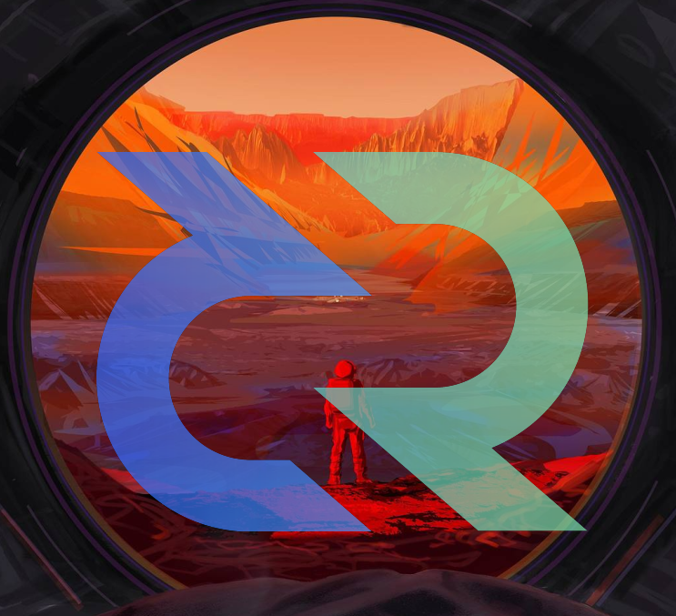
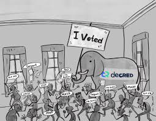
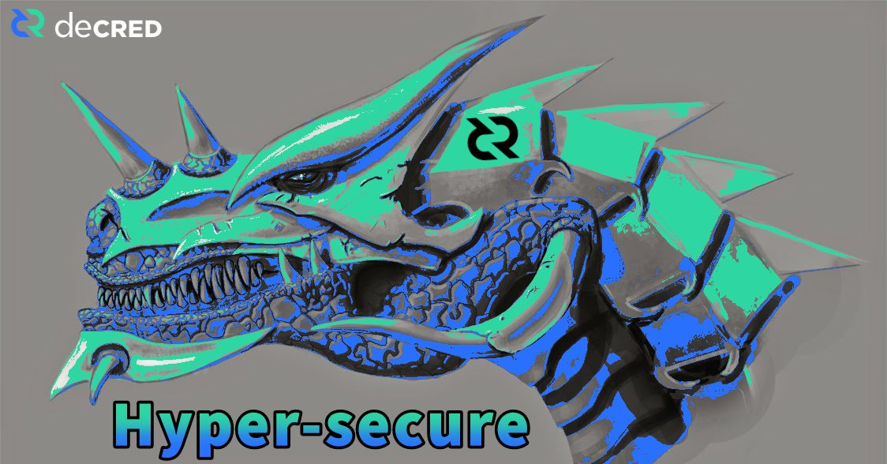

# Forward Thinking Friday - DD MMM YYYY

Welcome to Forward Thinking Friday, a regular venue to discuss ideas, concepts and designs that push Decred further, bigger and better. Topics raised can be anything ranging from:

- Technological improvements or enhancements

- Unique opportunities well serviced by the Decred protocol

- Responses to competing protocol designs and features

- Integrations and Infrastructure

- Marketing and Project Messaging

**No Idea is a bad idea.** We all have different skill and knowledge levels. This is an open forum to identify, discuss and fine tune the ideas, constraints and build solution pathways.

    "No Matter What People Tell You, Words And Ideas Can Change The World." - Robin Williams

    "If at first the idea is not absurd, then there is no hope for it." - Albert Einstein

## Summary - Round 1

https://www.reddit.com/r/decred/comments/hbp6y4/forward_thinking_friday_1_moving_the_peg_forwards/

1. Hardware wallet support for Tickets. I have many requests in my DMs for ledger/Trezor support of ticket purchases. I know this requires dev action so it would be ideal for some of the marketing teams to look at recruiting devs who could pick this up. This is important and if there are technical reasons it cannot be done - we should endeavour to solve them.

2. BTCPay Server and ColdCard support - If The maxi's won't let us in, fork it and make it ours. BTCPay server opens up strong tools for merchant adoption and inclusion of unique features like the Decred DEX and mix server would be a game changer. ColdCards are open source hardware/software and are best in class in my opinion for holding BTC. Would love to see firmware expand for DCR support.

3. Governance as a Service GaaS (need a better acronym) - How can BTC be locked into a Decred sidechain to participate in a skin-in-the-game vote? How can atomic swaps and LN be used in the same endeavour? How can Decred export Politeia as a service for sub-DAOs? Can we build a system of sub-DAOs with different ticket requirements representative of sub-companies?

4. Coloured Coins - Tokenising on Decred, could also be a part of the GaaS system above. I personally believe Securities will come to distributed ledgers and Decred is such a high assurance ledger it makes perfect sense to build such features. Note - Review CounterParty functionality

5. Privacy by Default - Once Mixing is added to Decrediton, I am keen to see features like Mix-and-Send, Mix-to-Receive, PayJoin etc where it increases the probability that most DCR circulating come from/go into a Mix enhancing the privacy across the board. I personally think that mixing should be a toggle option that once set, ensures that all actions on-chain are mixed by default. It is so cheap, this should be fairly non offensive and also creates additional miner income.

6. Address aliases (potential to include for Lightning Network to deal with longer address problem)

7. Lightning Network Chat Function (Juggernaut or even a Trollbox) https://medium.com/@johncantrell97/announcing-juggernaut-5bda48d34a18

8. Update "Latest News" section of decred.org to keep up to date with Journal and progress

9. Multi-sig functionality built into Decrediton (perhaps linked to Hardware Wallet Integration)

## Summary ROund 2 - Narratives

https://www.reddit.com/r/decred/comments/hg2a9k/forward_thinking_friday_decred_narratives_26_june/

1. **Evolution in Employment:** Decred destroys borders. It enables people around the world to coordinate and build value towards a central goal of sound money. Decred does not care about your background, past, culture or whether you are wearing pants. It employs people without discrimination who do good work, and demonstrate an appreciation of Decred project values and skin in the game contributions.

2. **Built to Last:** Decred's governance and treasury underpin its ability to evolve and self-sustain. This makes for an aligned incentive base and a technology stack uniquely designed for longevity.

3. **Elephant in the Room:** Governance is the topic in cryptocurrencies least understood but probably most important and hardest to get right. The graphic below remains one of my absolute favourites and speaks to numerous qualities of Decred personified as an elephant (intelligent, herd intelligence, safety in size, elephant in the room of governance. I am very keen to see this narrative built out, I think it is extremely powerful and nuanced.

4. **Armoured Lizard:** A h/t to Murad who personified Decred as a lizard and is a comparative to the Bitcoin Honey Badger. Shout out to OfficialCryptos for the Decred Dragon graphic below!

    https://twitter.com/OfficialCryptos/status/1273926304027508738/photo/1

5. **Universal Truth Anchor:** While the truth machine narrative has been associated with Bitcoin in the past, I do believe the features that differentiate Decred (hypersecure, fork resistant) will make it a better contender for this title, especially as the marketcap and the security of the network increases over time. Essentially, if it hasn't been timestamped or attested to the DCR chain, it didn't happen.

