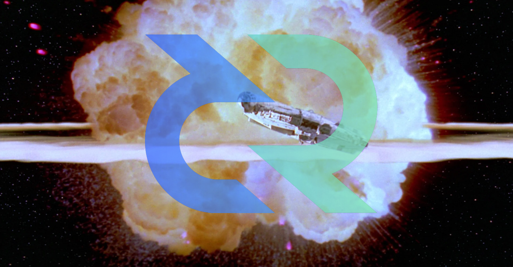

# Decred Skepticism Sunday - DD MMMM YYYY

This is a forum for project self-reflection identification of weaknesses and formation of solutions to drive positive change for the protocol. Concerns raised may focus on:

- Protocol design or technicals

- Areas requiring further research

- Economics or market infrastructure

- Marketing or community development

This initiative is borrowed from the Monero community and is a valuable culture to identify and manage the risks, challenges and uncertainties faced by the Decred project. Changing the world is hard, doing it well even more so.

    The Decred Falcon escaping chaos due to regular and constructive self-reflection (circa. 2142)

# Ground Rules

1. Building Decred is Hard. Please do not forget we are at the cutting edge of technology and social change and it takes immense time, skill, money and effort to deliver this project. Please comment accordingly.

2. Solutions or Considered Options should be presented alongside commentary of areas for improvement. Complaints are easy, solutions are hard. If you are not sure of a solution, that is ok, bring up the discussion and make an effort to seek an answer. Unproductive complaints without solutions are discouraged.

3. Be Respectful of readers, comments and critiques. Decred is an open source protocol where no one person is in charge. The primary objective of this initiative is to identify concerns and address them constructively. All holders of DCR are responsible for project outcomes and we get out what we put in.

4. Review past editions and don't hammer on repeated issues. Many issues take time to solve and concerns raised repeatedly have likely been heard. It is ok to return if progress does not appear to have be made

5. Utilise Up/Downvotes to Identify priority concerns. The biggest issues should rise to the top to ensure maximum attention.

# Suggested Format

Challenge or Concern: ____________________________ (note what, why and how it affects the project)

Potential Solutions:________________________________(options, examples, ideas, theories, ACTIONS)

# Summary Key Issues

## Issue 1 - 21 June 2020
https://www.reddit.com/r/decred/comments/hd4mwv/decred_skepticism_sunday_21_june_2020/

- Scalable process of scaling education, learning curve is very steep, easy access to 'Buy Decred' (gamification, leaderboards, consumable bite sized content)

- Formal governance process is only granular enough for highest level decisions. (Sub-DAOs to manage workflows, DAOStack as example framework)
