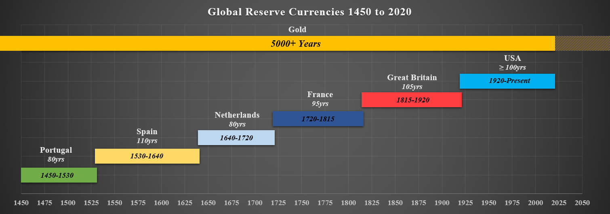
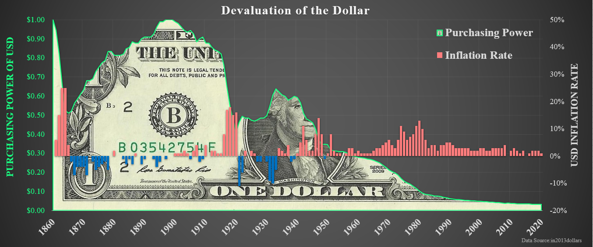
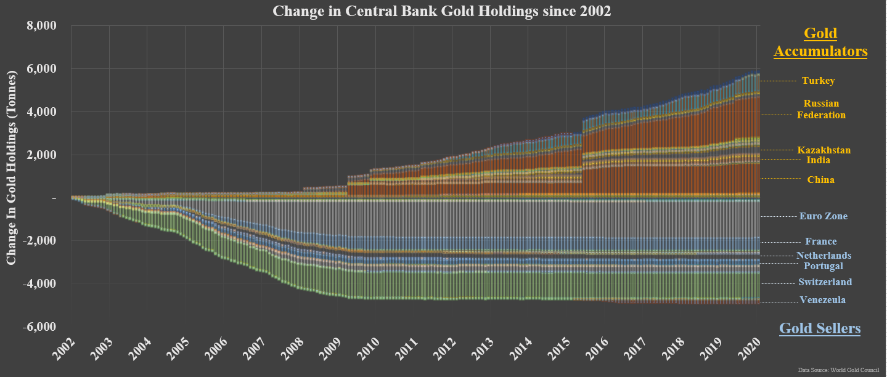
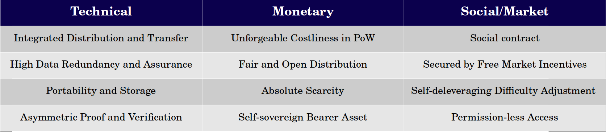

# Decred, COntrarian with Compliments

Cryptocurrency markets are extremely competitive. Not only is this nascent technology and undergoing dynamic evolution, it is rapidly becoming accepted as a new asset class by both public, private and, in some instances, state actors. The asymetric risk to return profile of cryptocurrencies has attracted the full range of market participants, from casual investors, institutions, entrepreneurs, speculators, gamblers, charlatans and scammers, all arriving within a compresed timeline of little over a decade.

    Most come for the financial gains, a few stay for the revolution.

Never in history has a technology as profound as a self-sovereign, apolitical, sound and immutable digital currency been needed more than today. Decentralised cryptocurrencies stand as one of the few sane insurance policies against ever increasing surveillance capitalism, currency debasement and political instability.

## Bitcoin Maximalism

Amidst an infinite array of coins, protocols, tokens and ponzi schemes, suffice to say, it is difficult for any project to stand out. This is particularly true as most evidence points to a singular marketing metric that actually matters, price. The ever expanding graveyard of digital tokens, failed ventures and billions in lost capital leaves few standing. 

After a number of years in the space, the author has experienced the sane gravity of Bitcoin maximalism. In many regards, it feels like one of the only models that makes sense and has a distinct product market fit. Over a long enough timeframe, Bitcoin consistently performs.

    Bitcoin epitomises unstopable digital sound money. It aims to force the hand of authority to abide by the discipline imposed by a 'gold' standard. Few protocols outside Bitcoin have the grit, security and ledger assurances to take this fight straight to the central banks.

Bitcoin is indeed the centrepiece of this revolution.

Everything about it feels right. From the cypher-punk roots, the unchainging monetary properties, and the organic free market rise to dominance. There are an infinite number of critiques leveled at Bitcoin over the years, and the author considers very few of them to have substance. One can only marvel at the simplicity and effectiveness of Satoshi's design. The elegance of Bitcoin principally attributed to the **alignment of incentives**.

    Bitcoin works because human incentives and self-interest are persistent across time and space. Bitcoin's design draws upon one of the few constants in human behaviour, greed.

This near-maximalist position forms an invaluable baseline for interpreting the crypto-asset landscape. However, nothing is without risks and everything is possible in a probabilitic universe. One cannot argue honestly that there are no risks nor limits intrinsic the Bitcoin design. The author finds it difficult to believe that there can, and will, only be one solution to the sound money problem.

This is the point where Bitcoiners level the age old counterargment of 'mah liquidity, reputation and network effects'. Truthfully, there is no question this argument holds water. But in the author's opinion, this describes Bitcoin's primary moat.

    Liquidity
    Reputation
    Network Effects

These three crucial features, coincidently, are usually the Achillies Heel for pretty much any quality cryptocurrency competitor. Indeed, perhaps outside Etheruem, the author cannot think of any other money protocol that holds a candle to Bitcoins L.R.N.

But does that really mean Bitcoin has already won?

## Winner Takes All?

The proposition of a 'winner take all' market for sound money stems from the central tenants of Austrian economics. It posits that a global convergence to a single monetary standard is more or less inevitable. After considering the history of money, and in particular Gold's role in it, this seems as rational and intuitive a take as Bitcoin maximalism.

For a digital disruption of money however, it is perhaps a jump several decades ahead of reality to assume this is the outcome, and even further to assume Bitcoin to be the only winner. This thesis also makes three fundamental assumptions which deserve to be challenged:

    Assumption 1: Bitcoin, as a zero to one technology, boasts a feature set, network effect and liquidity pathway that is so strong, it is destined to displace those of the 100yr old United States Dollar and ultimately, the 5000yr+ old gorilla, Gold.

    Assumption 2: Bitcoin's characteristics have already, or at least have a great probability to, solve the sound money problem of today, tomorrow and ever after, making it effectively undisruptable.

    Assumption 3: The market and process of open source, rough consensus governance will find a way to resolve all future conflicts and constraints regarding the evolution of the Bitcoin software to achieve outcomes not already attained under Assumption 2.

The leading argument Bitcoiners level against alt-coins, is that irrespective of features, no competitor could ever surpass Bitcoin's combination of liquidity, reputation and network effect, and thus, are doomed to fail.

If this were the case, why do they bet on Bitcoin in a competition against Gold?

Gold-bugs, usually from the same Austrian school of thought, may rightly be forgiven for considering Bitcoin a shitcoin. Monetary metals have effectively been a winner takes all market and the liquidity, reputation and network effects of Gold are orders of magnitude greater than that of Bitcoin. The characteristics and scarcity of Gold outcompete all other forms of money to date. Furthermore, there is no evolution possible that would enhance Gold's intrinsic properties, and therefore little to disrupt this balance...

...that is of course until a new paradigm arises where monetary metals must compete with digital scarcity protocols for market and mind-share.

## Money is a Competitive Landscape

For students of history who peer behind the fiat money curtain, it becomes obvious that this pure fiat monetary system is but a a blip in human economic history. Global empires, economies and sovereign currencies have risen, and fallen many times over, most often reverting to or being overtaken by a new economic equilibrium with a sound monetary base.

For 5000yrs+ that monetary base has invariably been Gold.

Gold is the datum, the meter, the second, the Pascal, of money. The single reference rate against which all commodities, currencies, goods and services can and have been valued against as a global standard for millenia. Gold is humanities long term **Unit of Account**. As the saying goes:

    No matter where you are in time, an ounce of fine gold will always buy you a fine suit.

Gold has consistently served its purpose as a scarce, sound store of value through all manner of economic realities, from deflation, to stagflation, to hyper-inflation. [Grant Williams summarised this convincing case](https://www.realvision.com/grant-william-keynote-speech) of Gold as the apex predator of money, chosen freely by the market and outlasting all past attempts at pure fiat currencies. Given the reliability and predictability of human greed, and the incentive to abuse and devalue unsound currencies, it is reasonably expected that Gold shall continue to be money long into the future.

**Paper money was an iteration on Gold**, solving for the divisibility and portability constraints of a scarce, heavy metal. Paper money benefits from the abstraction of a sound base, a role once afforded to [Silver](https://www.investopedia.com/articles/investing/080316/historical-guide-goldsilver-ratio.asp) until paper money superseded it as a technology, and decimated its monetary premium.

    Considering Silver continues to partake in impressive market rallies to this day, it is fairly obvious that even winner takes all metallic markets take centuries to play out in full.

Nevertheless, 'representative' Gold in the form of paper bank-notes, and the expansion of fractional lending it enabled, was a sufficiently superior feature set to Silver, that it changed the markets perception of value. The Gold-Silver ratio has never recovered, recently hitting a record of 1:120, a far cry from the fixed rate of 1:15 set by authorities as far back as the Roman empire.

    The feature set of paper claims over Gold, definitively outcompete Silver as money.

## Dirty Electronic Fiat

    "With the exception only of the period of the gold standard, practically all governments of history have used their exclusive power to issue money to defraud and plunder the people." - Hayek

**Modern 'electronic money' is an iteration on paper money**. Today, monetary value has been reduced to an account entry in a centralised database. Bank accounts and electronic money affords holders convenience of global payments, tap and go credit and access to business conducted over the internet. This makes for a superior medium of exchange to its paper and physical Gold predecessors. However, it is a provably woeful tool for wealth preservation.

Central Banks, governments and financial institutions have excelled in their ability to devalue fiat currency and ultimately, this purely fiat regime is temporary and has an expiration date. It was never selected by the market, and instead imposed.

The most rational assumption of a winner-takes-all thesis, would be that history repeats and the fatal flaws in unsound paper/electronic money will be outcompete by the reigning champion, Gold. In fact, the incentive and momentum behind such a reality is becoming increasingly apparent, observable in the balance of Gold accumulation and investment patterns of the world's Central Banks. *(Further exploration of this point is outside the scope of this paper, although the author recommends [this presentation]((https://www.youtube.com/watch?v=GEwuGHFF7qE)) for those looking to dig deeper)*.

## Absolute Digital Scarcity

**Bitcoin is a digital iteration on Gold** and a direct response to the extraordinary abuse of power by Central Banks. Even a cursory review of the [negative impacts](https://wtfhappenedin1971.com/) that followed uncoupling from gold, suggests that a return is sorely needed. At the root of the problem are a set of misaligned incentives which reward and motivate institutional opacity, excessive leverage and high time preference behaviour, with citizens desperately seeking an escape from perpetual currency debasement.

The ingenious design of Bitcoin by Satoshi is a remarkable improvement, not only on Gold as a scarce commodity, but on the combined distribution system and bearer asset of paper (or electronic) money built on-top of a Gold base layer. The reason Bitcoin is so important to our future is in the elegant and remarkable combination iterations on Gold:

It is often said that at the core of Satoshi's genius design, is the way he stitched together many pre-existing ideas to form the cohesive implementation of Bitcoin. By fusing the issuance, distribution and payment infrastructure of a verifiably scarce asset, with the portability of data on the internet, one could argue that Bitcoin's feature set has all the properties required to outcompete Gold as a future sound money base.

## First Mover Advantage

Given the almost unbelievable advantage Bitcoin has in features over Gold, it leaves little doubt to why Bitcoiner's believe it to be the ultimate successor. In the same way paper money usurped the throne from physical Gold, and electronic money after it, technological advantages of this magnitude may precipitate a phase change.

Bitcoin enters the fold not only with enhanced distribution, transparency and audibility, but with an absolute scarcity that trumps Gold on its most valuable sound money characteristic. Add to this the relative liquidity, reputation and size of Bitcoin amongst it's digital peers and its success can feel inevitable.

What chance do altcoins stand? The market has proven to date that simply iterating from one to ten on technology has not swayed Bitcoins dominance and Bitcoin maximalism has since become a powerful religion. The first mover advantage and zero to one nature of Bitcoin is undoubtedly the most likely disruptor of Gold.

## The Risk Free Asset

Sound money should be a risk free asset. Somewhere to park capital and value with confidence its scarcity cannot be tampered with and inflated arbitrarily. It should be reliably consistent and its future state as deterministic as possible.

It was the author's discovery of Decred that crystalised this opinion, and to such a great extent, that the author now considers it one of the ultimate beneficiaries of what is likely to be the greatest economic shift in history.

As a wise man once said, 'Bitcoin changed the way I think about money, but Decred changed the way I think about cryptocurrencies.'

*The remainder of this article aims to be a distillation of a contextualised bull case for Decred and why it is one of the soundest, hardest and most undervalued crypto-assets in the market. None of this shall be considered investment advice and shall be considered only as the opinion of the author*

Quite simply, the fight against centralised authority has only just begun, and the paradigm of digital money cannot stop with one idea. Perhaps in the long run, there will be a collapse to a singluar monetary asset, however the history of money, reserve currencies and society suggests this process will take many decades at best.

Whether this market results in a winner take all, a pareto long tail or something else entirely, it is the authors opinion that this 

We will return to the argument for a winner takes all market shortly, but first, let's briefly touch on the nature of consensus.

## The Nature of Consensus

There are two critical layers to consensus in cryptocurrencies:

**Machine Consensus**, captured by the concept of 'code is law', whereby the consensus rules are encoded to the protocol and enforced by unforgeable computation and/or validation nodes. Machines do exactly what they are told, without question, and cannot amend rules without explicity human intervention.

**Human Consensus**, often referred to as the social contract, is the ultimate decision making engine when it comes to all alterations made to the protocol rule set. In a sound money protocol, no single authority or concentrated cartel should posses sufficient power to alter machine consensus without majority network consent.

**Protocol governance** is thus defined as the process by which proposals for changes to protocol direction, and subsequent code upgrades, are made, debated, negotiated, implemented or rejected.

All cryptocurrency projects have both a machine and a human consensus layer. All cryptocurrencies (yes, even Bitcoin) have a governance process. In the author's opinion, it is the balance of incentives and power between these two consensus layers which makes, breaks and defines the viability and success of all cryptocurrenty protocols.

    Few understand this.

Bitcoin, by design, must move slowly and cautiously. Proof-of-Work consensus
ough consensus governance is a naturally political process and whilst it provides strong assurances of an unchanging monetary policy and extreme hardening against capture, 

The remainder of this article will detail the logic and reasoning which underpins this opinion and why the author firmly believes that Decred stands as Bitcoin's most complimentary competition.

## Decred is Different

Decred is akin to the nerdy kid at school, smart as fuck, and a little socialy awkward. Introverted, harder to comprehend and distinctly different to others, it receives only critique and tease though its formative years.

There is a great saying from my life which resonantes strongly:

    'Befriend the nerds at school, they will be your boss' - Anon

Decred is that nerd. 

As the sands of time wear away at detractors, the realities of their constraints will come to the foreground. Rough consensus devolves to politics, indecision wears talent developers to a state of apathy and leverage accumulated on-chain makes systemic risk a main-stay feature. Ultimately, these approaches recreate the same fiat system society desperately needs to escape.

The fundamental reason Decred will survive, and thrive, is precisely because of its difference in design. Decred boasts a unique blend of lessons learned and iteration and cunningly optimised for the one crucial feature that no other blockchain has:

The ability to be distributed, and decisive.

## Hybrid Consensus

The true elenagnce of Decred originates in its hybrid consensus model.

**Proof-of-Work** is a consensus of machines. It ensures an unforgeable expendature of energy, capital investment in hardware and unforgeable costliness is embedded into every block, assuring finality of the past until an attacker overcomes past work.

    Machines execute exactly what they are told to do, rightly or wrongly. Proof-of-Work excels at maintaining consensus over a set of rules as they are already defined.

**Proof-of-Stake** enables human consensus. Stake ensures that explicit decisions to bind capital (an abstraction of spent time) to the chain for validation of state carries financial consequence. Stake networks coordinate consensus over the present state, and thus sacrifice finality of the past in return for flexibility of the future.

    Human consensus is both messy and coordinated, chaotic and orderly. It excels at flexibility and formulation of new rules at the expense of finality, especially over the past.

Decred hybridised both consensus models, weaving human consensus in Proof-of-Stake over the unforgeable assurances provided by Proof-of-Work.

---

In order to fully appreciate what Decred has built, it requires an appreciation of both the strength and constraints of Bitcoin. The Austrian economic principles which underly human psychology, and dire necessity for the world to return to a sound monetary base has never been clearer.

Decred is both the tortoise and the Hare

Bitcoin
    Advantages
    - Rough consensus
    - slow upgrade process (Taproot)
    - Privacy implementation
    - Miner checks and balances
    - Resistance to state based capture
    - technical debt and controlled hard-forks
    - Explicit governance and stakeholder approval of code
    - Assurance of future relevance

    Disadvantages
    - Reputation (process of time and sustainability)
    - Lindy effect (designed to survive)
    - Liquidity (doesn't need to be equal, just big enough)

Ethereum and Defi
    Advantages
    - Simplicity over complexity
    - Primitives develop incrementally
    - Defined governance structure rather than rough/on-chain medley
    - Resistance to corporate and state capture (KYC/AML and regulations)
    - Decred is itself a DAO

    Disadvantages
    - Developer ease of access
    - Attraction of rapid new features

Differentiators

- Monetary assurances
    - Similar to Bitcoin
    - Differentiates on sustainability, evolution to sustain fees,ability to innovate, scale and adress needs

- Tehcnological evolution
    - Similar to Bitcoin in conservative design
    - Analogous to Monero but with assurance of decisiveness long term
    - Faster to iterate that Bitcoin, less

- Self-sovereign funding
    - Similar to ZCash but 
    - Differentiates on implementation, governance and distribution
    - Differenciates to XMR without reliance on donation and 
    - Differentiates to ETH and XTZ ICO (lack of transparency, centralised pooling, central planning)

- DAO Model of governance
