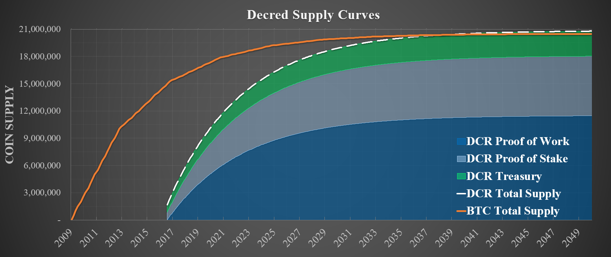
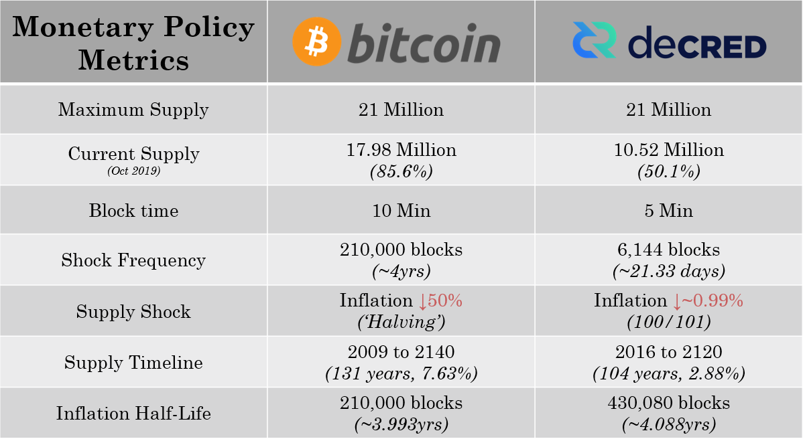
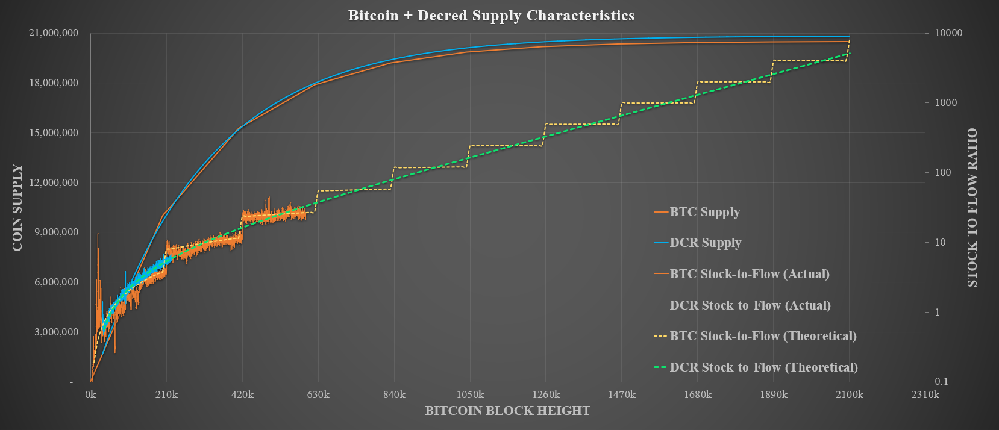
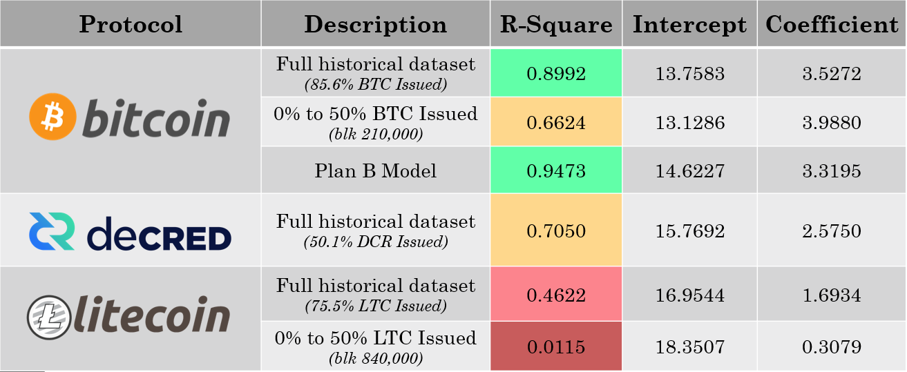
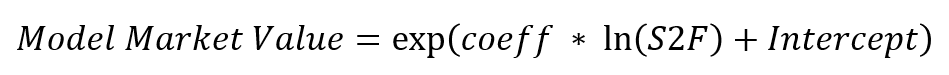
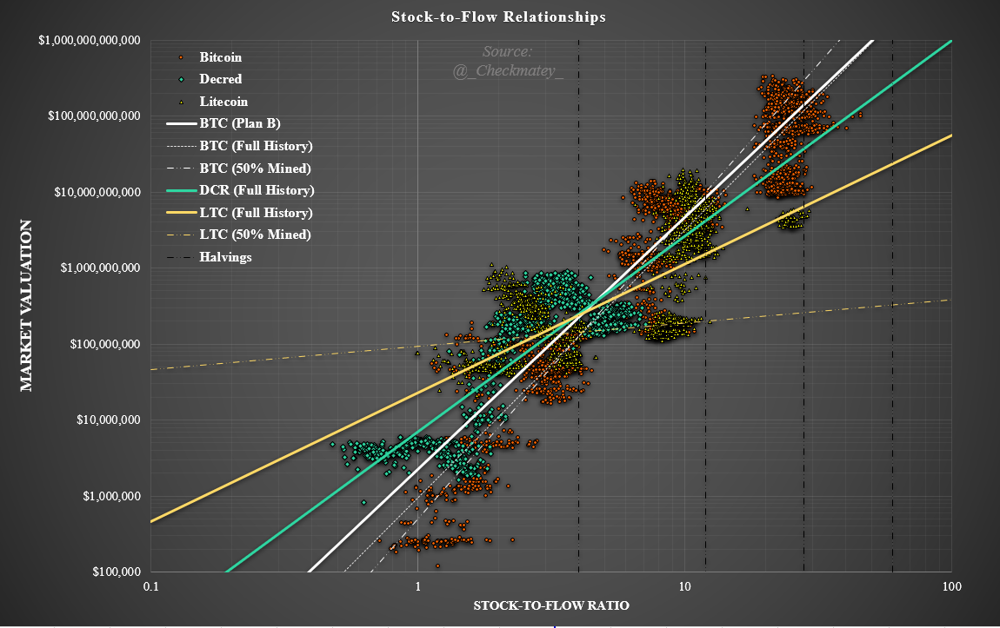
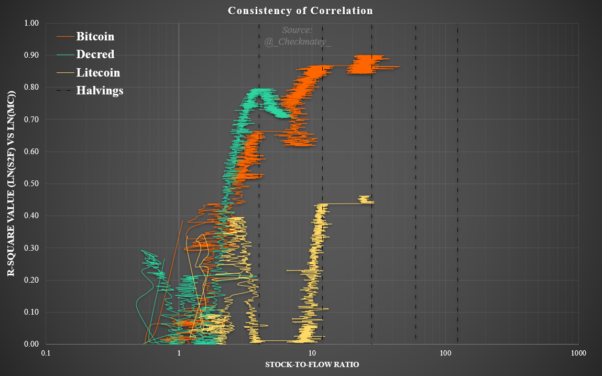
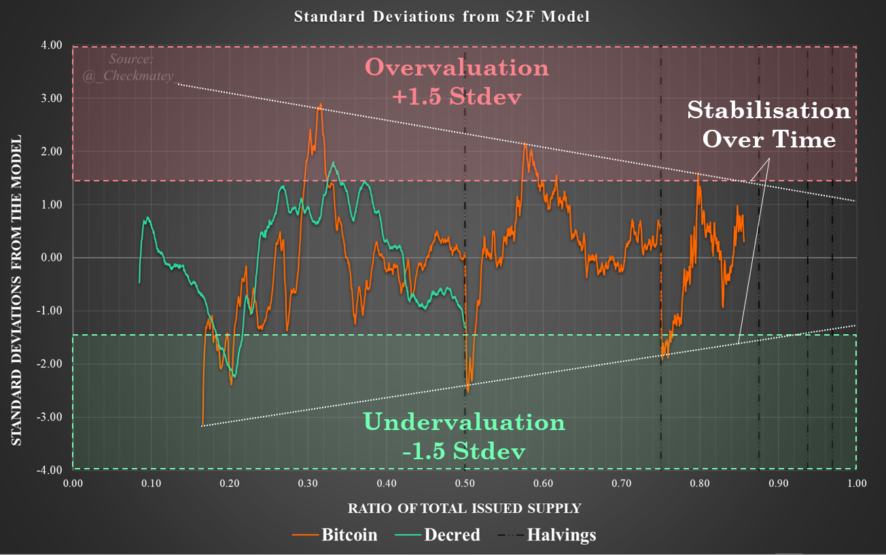
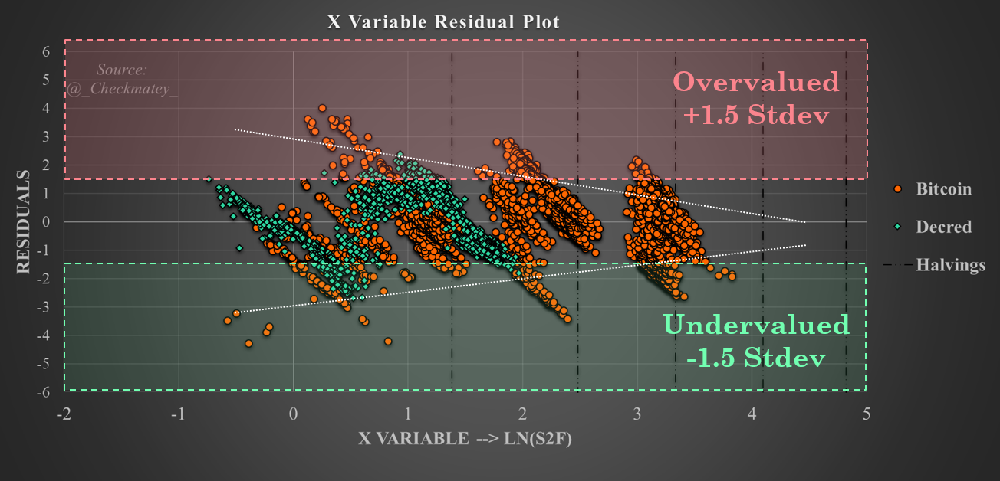
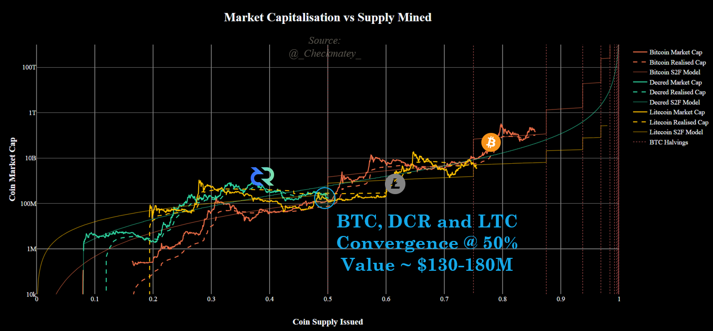

# Decred, following in Bitcoin's Footsteps
*by Checkmate*

*14-Oct-2019*

**Decred** is one of the most promising cryptocurrency projects and a sound competitor next to **Bitcoin** in the free market for digital and scarce monetary assets. At a minimum, strong market competition forces innovation and hardening of the strongest protocols whilst also providing a rational hedge for risk during the nascent development of digital money.

As **Bitcoin**  continues to assert it's market dominance, it is the correct benchmark against which competitors must be compared. The following article is the first of a three part study into **Decred** from a data driven and first principles perspective. The series aims to critically compare the performance of **Decred** and **Bitcoin** across the following value metrics:

1. Monetary policy and Scarcity (this paper)
2. Cost of Security and Unforgeable Costliness
3. Governance, User Adoption and Resilience

# Background

Previously I explored a [comparison between Alt-coins and **Bitcoin**](https://medium.com/@_Checkmatey_/monetary-premiums-can-altcoins-compete-with-bitcoin-54c97a92c6d4) in regards to their Monetary Premiums. This study considered a simple methodology relating scarcity, as measured by stock-to-flow ratio, to market value inspired the work of [Plan B](https://medium.com/@100trillionUSD/modeling-bitcoins-value-with-scarcity-91fa0fc03e25) for **Bitcoin** which established a fundamental power law relationship between scarcity and market valuation. This **Bitcoin** specific relationship acts as a valuable baseline against which alternative fixed supply cryptoassets could be compared as an initial screening.

A key outcome of this paper was that **Decred** appears to have developed and maintained a convincing monetary premium, well in excess of the other alt-coins considered. **Decred** actually appeared to outperformed **Bitcoin** in it's early days by maintaining a valuation above the power law mean for over 64% of it's lifespan compared to 31% for **Bitcoin**. It is therefore appropriate to expand this study with the intention to add statistical rigor and quantify the validity of **Decred's** monetary premium.

What I explore further in this article, is the depth to which **Decred's** market valuation and performance is comparable to **Bitcoin** in its early history. An apples to apples, 3.67 year old **Decred** to 3.67 year old **Bitcoin** comparison.

## Disclosure

*This paper was written and researched as part of the author's [research proposal](https://proposals.decred.org/proposals/78b50f218106f5de40f9bd7f604b048da168f2afbec32c8662722b70d62e4d36) accepted by the Decred DAO. Thus, the writer was paid in DCR for their billed time undertaking the research. Nevertheless, the study aims to be objective and mathematically rigorous based on publicly available market and blockchain data. All findings can be readily verified by readers in the attached [spreadsheet](https://github.com/checkmatey/checkonchain/tree/master/research_articles/dcr_following_footsteps) and all assumptions shall be clearly stated.*

# Why Decred?
**Decred** is founded on the same core sound money principles as **Bitcoin** yet differentiates significantly in three areas:

1. **Decred's Security** and consensus utilises an innovative and elegant Hybrid PoW/PoS mechanism. This system can reasonably provide superior [ledger assurances](https://medium.com/@permabullnino/introduction-to-crypto-accounting-an-analysis-of-decred-as-an-accounting-system-4d3e67fce28?source=search_post---------2) (Permabull Nino, 2019) and an order of magnitude higher cost of attack per unit of market value when compared to **Bitcoin** ([Zubair Zia, 2018](https://medium.com/decred/decreds-hybrid-protocol-a-superior-deterrent-to-majority-attacks-9421bf486292); [Fiach_Dubh, 2019](https://medium.com/coinmonks/comparing-double-spend-resistance-decred-vs-bitcoin-part-1-330c8081b2a9)).

2. **Pre-established Governance Mechanism** which allocates upgrade decision capacity and risk ownership to DCR holders. The governance system is comprised of off-chain signaling via [Politeia](https://proposals.decred.org), social media channels (Matrix, Twitter, Reddit etc.) and binding on-chain voting for consensus level changes via the [**Decred** ticket system](https://docs.decred.org/proof-of-stake/overview/). Decred governance is underpinned by the [Decred constitution](https://docs.decred.org/governance/decred-constitution/) and a remarkably strong social contract [(Haon, 2019)]((https://medium.com/@NoahPierau/unpacking-decreds-social-contract-69c413aa652)) which to date has shown capacity for attracting and retaining a strong community mind-share. The **Decred** governance mechanism enables efficient yet distributed implementation of upgrades to adapt the protocol for future risks.

3. **Distribution of block rewards** allocates 60% to Proof-of-work miners in return for CAPEX and OPEX costs; 30% to DCR ticket holders to incentivise governance participation and security; and the final 10% to the **Decred** Treasury which is owned ([and soon to be operated by](https://proposals.decred.org/proposals/c96290a2478d0a1916284438ea2c59a1215fe768a87648d04d45f6b7ecb82c3f)) **Decred** stakeholders. **Decred** thus incentivises participation of Miners, Stakeholders and Builders in contrast to **Bitcoin's** 100% allocation to Proof-of-Work Miners. This makes the **Decred** protocol one of the largest operational decentralised autonomous organisations with over [646,275 DCR ($10.34M)](https://explorer.dcrdata.org/address/Dcur2mcGjmENx4DhNqDctW5wJCVyT3Qeqkx?chart=balance&zoom=ijhhasg0-k1st3q80&bin=month&txntype=merged_debit) in assets stored in the Treasury at the time of writing.

In this light, **Decred** has a uniquely differentiated value proposition among the landscape of crypto-assets and thus represents a strong candidate for a sound money store of value protocol. **Decred** therefore presents a valuable opportunity to study the early age performance of a contender for digital money with the benefit of **Bitcoin** hindsight.

# Part 1 - Monetary Policy and Scarcity
This is the first part of this research series aiming to compare the monetary policy and scarcity relationship between stock-to-flow ratio and market valuation for **Decred** and **Bitcoin**. 

## Monetary Policy - Commonalities 
The core value proposition of **Decred** is near identical to **Bitcoin** in that it represents an opt-in, self-sovereign and immutable digital store of value money.

**Decred** has thus retained the sound money principles of **Bitcoin** including:
- 21 million maximum unit supply of DCR
- 100,000,000 divisible units (atoms) per DCR, equivalent to satoshis of Bitcoin
- Deterministic supply schedule by block height

Decred's overall supply curve actually approaches that of **Bitcoin** with comparable circulating supplies estimated around Mar 2038.

## Monetary Policy - Differences

Material differences between **Decred's** and **Bitcoin's** monetary policies can be summarised as follows:
- Decred launched with an 8% pre-mine (1.68 million DCR) whereby half (864k DCR) was airdropped free to community members to bootstrap Proof-of-Stake security and the other half purchased by the team at a rate of $0.49/DCR. Bitcoin launched without a pre-mine and instead launched with only a small collective of cypherpunks aware if it's existence. Both initial distribution systems acted as a reward structure for those who committed to nurturing the network through early life. Within the first year it is estimated that Satoshi Nakamoto was the dominant Bitcoin miner having mined a lower bound a estimate of 700k to 800k BTC before the protocol and significant new miner interest ([BitMex, 2018](https://blog.bitmex.com/satoshis-1-million-bitcoin/); [Held, 2018](https://blog.picks.co/bitcoins-distribution-was-fair-e2ef7bbbc892)).

- The **Decred** block reward starts at 31.19582664 DCR per ~5min block time and the reward is distributed at a rate of 60% / 30% / 10% to Proof-of-Work miners, Proof-of-Stake Stakeholders and the **Decred** Treasury Fund, respectively. This compares to **Bitcoin** which starts at 50 BTC per block issued every ~10mins allocated in full to Proof-of-Work miners.

- **Decred's** monetary policy does not include a significant supply shock 'halving' event as **Bitcoin** does every 210,000 blocks (~4 years). Instead, its block reward follows a smooth reduction by [100/101 every 6,144 blocks](https://docs.decred.org/advanced/inflation/), equating to a reduction of approximately 0.99% to the total block reward every 21.33days. The effective inflation half-life is approximately equal at around 4years for both protocols.

Key monetary policy characteristics of Bitcoin and Decred are summarised in the table below.

To illustrate the similarity between monetary policies, we can superimpose **Decred** launching at the block-height when **Bitcoin's** circulating supply reached 1.68million BTC (equivalent to **Decred's** initial pre-mine = BTC block 33,600) to compare progression of the stock-to-flow ratios and supply curves.

What is immediately clear is that **Decred's** stock-to-flow development approximates the mean trajectory of **Bitcoin** and traverses the same set of stock-to-flow values with exception of halving events. 

## Stock-to-Flow Ratio

Stock-to-flow (S2F) ratio is the ratio between the 'above ground'/circulating supply of an asset and the annual inflation rate, thus representing the number of years of production required to double the current supply. It is a concept generally suited to commodities and fixed supply crypto-assets and may be throught of as a measure of Scarcity. A higher the S2F ratio suggests a scarcer asset and a consistent S2F ratio is over time indicates a resistance to inflation (hardness).

[Plan B has shown](https://medium.com/@100trillionUSD/modeling-bitcoins-value-with-scarcity-91fa0fc03e25) that a fundamental power-law relationship between stock-to-flow is observable for **Bitcoin**. Subsequent statistical checks have further validated this model by confirming S2F and Value for **Bitcoin** are co-integrated ([Nick, 2019](https://medium.com/@phraudsta/falsifying-stock-to-flow-as-a-model-of-bitcoin-value-b2d9e61f68af); [BurgerCrypto, 2019](https://medium.com/burgercrypto-com/reviewing-modelling-bitcoins-value-with-scarcity-part-ii-the-hunt-for-cointegration-66a8dcedd7ef)). 

Given similarities in monetary policy and stock-to-flow ratio, it reasonably follows that a similar linear regression calculation may be undertaken for **Decred**. This provides a gauge for the monetary premium developed especially if equivalent statistical rigor is established. The regression fit and constants should be compared with respect to the age of the coin and state of progress through its issuance schedule. 

In the instance **Bitcoin** continues to outperform in this relationship, it may be reasonably attributed to the combined influence of Satoshi's 'immaculate conception', first mover advantage, network effects and the halving supply shock events. If on the other hand a comparable monetary premium and model confidence is observed for **Decred**, it supports further consideration of **Decred** as a viable digital store of value candidate.

For comparison, the same calculation will be undertaken for **Litecoin** which launched in 2011 and for all intents and purposes, represents a direct clone of **Bitcoin** with negligible alteration to the protocol or monetary policy.

# Methodology

The regression analysis has been undertaken as follows:

1) Data is acquired for BTC, DCR and LTC from the coinmetrics.io community dataset. Early price data for Bitcoin is supplemented with [data originally used in Plan B's model](https://github.com/100trillionUSD/bitcoin). Similarly, DCR data is supplemented with the genesis pricing of $0.49/DCR and early data from Bittrex not included in the coinmetrics data-set. Data is thus considered on a daily basis.

2) Calculate the daily annual inflation rate of native coins (assuming 365.25 days/yr) and the corresponding Stock-to-Flow ratio. Assuming a power-law relationship exists, the natural logarithm of both S2F and Market Cap are taken and used in linear regression models.

3) Considering the quality of a regression analysis is dependent on the size and quality of the input data-set, an additional set of calculations are undertaken looking at the R-Squared coefficient over time. This aims to observe the quality of the Bitcoin model fit with due consideration of the age difference between **Bitcoin**, **Decred** and **Litecoin**. It is expected that if a sound monetary premium is developing, the model fit would improve as more market data comes to light leading to an increasing R-square coefficient.

4) Results are presented normalised against Stock-to-Flow Ratio or the proportion of total supply issued to normalise for the age of each protocol with commentary provided.

The model spreadsheet is available [here](https://github.com/checkmatey/checkonchain/tree/master/research_articles/dcr_following_footsteps) for inspection and verification.

# Analysis Results
## Stock-to-Flow Relationships

The results of the linear regression analysis including model parameters and R-squared fit coefficients are presented in the table and figure below. For Bitcoin and Litecoin, a second regression analysis is undertaken considering only the first four years of data (pre-halving #1) to align with Plan B's follow up analysis which showed four years of data provided a very strong model fit.

By plotting the market valuation against stock-to-flow ratio in log-log space, we can verify visually that the linear regression calculation indeed matches the available market data for each protocol.

## Bitcoin
All three **Bitcoin** regression models show a consistent fit and generally agree with Plan B's model. A positive correlation exists between the R-squared coefficient and larger input data-sets with more price history. Indeed the full history of Bitcoin very closely matches the model developed by Plan B with an R-squared of 0.899.

[Plan Bs original model](https://github.com/100trillionUSD/bitcoin) utilised monthly price data (first of each month) whereas this study considers the average daily close price data. Whilst the outcome is consistent, the pre-halving model using the set of daily **Bitcoin** data provides an R-squared value of only 0.6624, whilst the fit using monthly price data is 0.894. This highlights the importance of temporal distribution of input data which has shown to make statistically significant differences to the model fit.

At halving events there is a significant change to Bitcoin's Stock-to-flow ratio which is not immediately followed by an equivalent shift in network valuation. Therefore one must be cautious when selecting data to avoid heavily weighting the analysis by data immediately after a halving event.

Nevertheless, given the full suite of price data for **Bitcoin** it is the author's opinion that Bitcoin has an undeniable and quantifiable monetary premium and is indeed an appropriate baseline against which other models should be compared. This analysis provides yet another independent verification that a strong relationship exists between stock-to-flow and network valuation for **Bitcoin**.

## Decred

**Decred** has shown a statistically significant relationship between Stock-to-Flow and market valuation with an R-squared value of 0.70 considering only the first 3.67 years of price data. It can be seen that this relationship is a comparable fit to **Bitcoin's** using data up to the time of the first halving with an R-squared of 0.66.

The overall fractal for **Decred's** S2F relationship appears to oscillate around the mean regression line which appears smoother over time than **Bitcoin** or **Litecoin** likely a result of the smooth issuance curve and lack of severe halving event supply shocks.

The early tail (low S2F value) of the data plotted above speaks to the difference in market dynamics at the time when first price data first became available for each protocol. Despite high early inflation, **Decred's** tail is consistent around a market value of $5Million until the S2F ratio approaches ~2.0 at which point valuation accelerates during the 2016-17 bull run. **Bitcoin** on the other hand experienced a far slower growth during the 2011-12 bull market with a smaller pool of participants. Early **Bitcoin** price data sources range from Laszlo's 10,000 BTC pizza to early Mt Gox pricing leading to a lower relative value at similar S2F values.

It must therefore be noted that the gradient of the **Decred** relationship is heavily weighted by this tail end especially during the first 3-4 years of life. **Decred** has only existed through a single **Bitcoin** bull-bear cycle and thus has a comparatively limited dataset whilst **Bitcoin** has largely overcome this effect with its now 10+ years of price data and multiple market cycles.

In summary, **Decred** is showing signs of developing a strong monetary premium with respect to it's scarcity measured by stock-to-flow ratio. 

This model must be revised in the next 12-24 months as it is likely the regression fit will be improved if **Decred** experiences strong market performance over this time. Similarly, poor future performance will negatively influence the regression fit.

## Litecoin
**Litecoin**
Based on the results and sensitivity studies presented, Litecoin does not seem to be developing what the author considers a convincing or competitive monetary premium. This is consistent with the [original screening analysis](https://medium.com/@_Checkmatey_/monetary-premiums-can-altcoins-compete-with-bitcoin-54c97a92c6d4) and this study justifies the position based on the low R-squared value. It is noted that the model fit is not improved by any significant magnitude through adjusting the resolution of data inputs.

It is the author's opinion that **Litecoin** does not display a convincing relationship between stock-to-flow scarcity and market valuation.

## R-Squared Development over time

To quantify the relative model fits and account for different timescales of data considered in the analysis, the R-squared coefficient has been calculated over a expanding data-set and then plotted against Stock-to-Flow. 

Confidence in a S2F-Value relationship for **Bitcoin** and **Decred** has generally increased over time with a notable deviation in the lead up to the point of 50% of supply mined. This indicates a consistent demand is present for both protocols to absorb the relatively high coin inflation during the first four years and maintain or grow network valuation.

For **Bitcoin** the drift at 50% mined is explained by the first halving event which increases S2F with no direct impact on value leading to an immediate undervaluation according to the model. For **Decred** this may reasonably be attributed to the 2018-19 bear market conditions and generally low market engagement towards alt-coins during the pre-2020 halving **Bitcoin** bull market. 

**Litecoin** can be seen to perform poorly over it's entire trading history with a peak R-squared value of around 0.46. This plot indicates that market valuation does not respond strongly following **Litecoin** halving events suggesting sustained accumulation is not taking place.

By comparing the residuals and deviation of **Bitcoin** and **Decred** market value from the S2F model as a ratio of standard model error, we can observe repeated fractals indicating undervaluation and overvaluation.

Both protocols have seen a relative undervaluation at ±1.5 standard deviations from the model and has historically represented a period of maximum opportunity. Of note is that over-time, Bitcoin's market value has shown to stabilise as the protocol grows in size and audience with each market cycle.

## Conclusions

This paper has compared the monetary policies and intrinsic scarcity properties of **Bitcoin** and **Decred** in the context of a stock-to-flow relationship.

A suite of linear regression analyses and sensitivity studies have been performed for **Bitcoin**, **Decred** and **Litecoin** to provide mathematical rigor to the observed relationships.

**Bitcoin** has clearly developed a strong monetary premium with extremely high R-squared values around 0.90 when considering daily pricing and blockchain data across its full history. Of note however is that at an equivalent age as Decred at the time of writing (3.67 years), the regression model for **Bitcoin** has an R-squared value of 0.66 which is comparable to **Decred's** fit of 0.70. This suggests that a complete four year data-set and ideally two full market cycles are required to establish confidence in a Stock-to-Flow model.

**Decred** in its nascent stage is developing a convincing monetary premium commensurate with Bitcoin in its early years. Given the increased competition with other alt-coins for market share, this is quite a remarkable observation. A conclusion of this study is that there is an underlying source of buy demand for DCR which is certainly higher than that for **Litecoin** and even **Bitcoin** at the same age.

Given the importance of the timescale of data considered for these models, this analysis must be revisited in 12 to 24 months to quantify whether **Decred** retains, improves or loses its observed monetary premium. Additional studies into the statistical rigor of the model such as co-integration must be included at that time to validate the model.

As a final projection of the path ahead, all three protocols at the point of 50% issuance have interestingly attained a similar market value between $130M and $180M. From this time, **Bitcoin** has continued to perform strongly whilst **Litecoin** has shown progressively weaker performance over time.

**Decred** is only just getting started on its journey having just crossed the point of 50% DCR issued.

The test for **Decred** is now which of these two paths it follows. Based on this analysis, it is the author's opinion that probabilities favor **Decred** following in **Bitcoin's** footsteps on the path to becoming a global, immutable, digital, and secure sound money store of value protocol. 

## References
[1]  Modelling Bitcoin’s Value with Scarcity, https://medium.com/@100trillionUSD/modeling-bitcoins-value-with-scarcity-91fa0fc03e25 – Plan B, 2019

[2] Modelling Bitcoins stock-to-flow and other metrics – various charts and analysis, https://twitter.com/100trillionUSD, Plan B, 2019 onwards.

[3] Monetary premiums, can altcoins compete with Bitcoin?, https://medium.com/@_Checkmatey_/monetary-premiums-can-altcoins-compete-with-bitcoin-54c97a92c6d4, Checkmate, 2019

[4] Reviewing “Modelling Bitcoin’s Value with Scarcity” —Part II: The hunt for cointegration, https://medium.com/burgercrypto-com/reviewing-modelling-bitcoins-value-with-scarcity-part-ii-the-hunt-for-cointegration-66a8dcedd7ef, BurgerCrypto.com, 2019

[5] Falsifying Stock-to-Flow As a Model of Bitcoin Value, https://medium.com/@phraudsta/falsifying-stock-to-flow-as-a-model-of-bitcoin-value-b2d9e61f68af Nick, 2019

[6] Introduction to Crypto-Accounting: An Analysis of Decred as an Accounting System, https://medium.com/@permabullnino/introduction-to-crypto-accounting-an-analysis-of-decred-as-an-accounting-system-4d3e67fce28, Permabull Nino, 2019

[7] Decred’s hybrid protocol, a superior deterrent to majority attacks, https://medium.com/decred/decreds-hybrid-protocol-a-superior-deterrent-to-majority-attacks-9421bf486292, Zubair Zia, 2018

[8] Comparing Double Spend Resistance: Decred VS Bitcoin — Part 1, https://medium.com/coinmonks/comparing-double-spend-resistance-decred-vs-bitcoin-part-1-330c8081b2a9, Fiach_Dubh
, 2019

[9] Does Satoshi have a million bitcoin?, https://blog.bitmex.com/satoshis-1-million-bitcoin/, BitMEX research, 2018

[10] Bitcoin's Distribution was Fair, https://blog.picks.co/bitcoins-distribution-was-fair-e2ef7bbbc892, Dan Held, 2018

[11] Decred documentation, https://docs.decred.org/

[12] Coinmetrics Community Dataset, https://coinmetrics.io

[13] Data Files for this study, https://github.com/checkmatey/checkonchain/tree/master/research_articles/dcr_following_footsteps, Checkmate, 2019
