# Decred, Mining Market Mechanics

> Proof-of-Work works.

It is the most robust and battle tested machine consensus protocol in the cryptocurrency market, nearing 11yrs of uninterrupted operation for Bitcoin and 4.5yrs for Decred. It is also one of the least understood components of network design.
This article aims to provide an fundamental overview and analysis of the Decred mining market to date, covering the following parts:

- **Part 1 - Proof-of-Work Mining Overview**

- **Part 2 - History of Decred mining**

- **Part 3 - Miner Supply Distribution Analysis**

- **Part 4 - Performance and Profitability of Decred miners**

- **Part 5 - On-chain metrics related to the mining market**

Understanding the incentives, mechanics and performance metrics of the Decred chain's largest natural seller sheds light on both market pricing, and the strength of network security. This research should provide a sound basis for interpreting the context and performance of the Decred mining market.

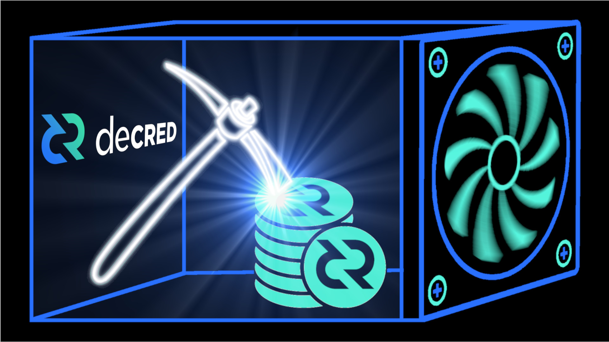

## TL;DR

1. Distribution data suggests GPU miners, who dual mined Decred with Ethereum in 2016–17, immediately distributed the majority of mined DCR to exchanges during the 'Great Inflation'.

2. ASIC Miners invested in hardware at the peak of the 2018 bull market. Research suggests that the majority of ASIC miners have been extremely challenged by the bear market with most capitulating. However, the worst of the storm appears to be over.

3. ASIC miners distribute a consistent 30–40% of coins to exchanges, 30% to unknown destinations (likely to OTC desks) and stake up to 30% of their income (at least for one ticket). This further justifies skin-in-the-game incentive alignment.

4. Decred has four primary mining related on-chain metrics; Block subsidy models, Difficulty Ribbon, Puell Multiple and the Miner Pulse. All four have shown extremely high signal and correlation to historical events. In the author's opinion, this is a sound validation of their reliability.

5. Most importantly, whilst miners have distributed DCR coins heavily into the market, this has become a long term strength. By distributing coins, this process reinforces Decred's governance and ownership decentralisation significantly. This provides high assurances of resilience, security and self-sovereignty long term.

# Part 1: Proof-of-Work Mining Overview

Decred miners are responsible for processing transactions and building the blockchain.  Miners compete to solve the next block via computationally intensive work (BLAKE-256 hash function). Miners are rewarded with freshly minted DCR coins via the block subsidy, and receive any fees paid by the mined transactions. As the block subsidy reduces towards the 21M hardcap, transaction fees will account for a greater portion of the incentive to mine.

The puzzle miners solve is akin to finding a needle in an extraordinarily large haystack. To maintain a relatively consistent block-time of ~5mins, the Decred protocol adjusts the complexity of the puzzle (size of haystack) in response to changes in the amount of hash-power (people looking for the needle). More miners means a harder puzzle (and vice-versa).

Protocol Difficulty adjusts every 144 blocks (~12hr window) based on an exponential moving average of the last 20 windows. For comparison, Bitcoin difficulty adjusts at~2 week intervals. More frequent difficulty adjustment adds resolution to Decred hash-rate and difficulty, making the protocol more responsive to changes in the mining network. This makes them useful and reliable metrics for monitoring mining performance, as we will see later in Parts 4 and 5.

## Purpose of Proof-of-Work

The core purpose of Proof-of-Work, and the key reason it is such a robust consensus protocol, comes down to three invaluable features:

1. **Machine Consensus:** Nakamoto consensus, whereby machines agree on chain history being the one with the most accumulated work, is exceptional at enforcing a singlular ordering of transactions and adhering to the currently defined rule set.

2. **Unforgeable Costliness:** Computation requires expenditure of energy and assures that chain history is expensive to tamper with. Minted coins are also imbued with an unforgeable cost of production, they cannot be created or duplicated without performing work on the consensus chain.

3. **Distribution of Coins:** Miners are compulsory sellers. The unforgeable expense on hardware and electricity cannot be avoided, and thus some, or all of the mined coins, must be sold to recuperate costs, ensuring wide distribution. For Decred, this is particularly important as DCR tickets are the vector for protocol governance.

    
> Proof-of-Work imbues DCR with unforgeable costliness, gives the chain immutable characteristics and ensures coins are widely distributed.

## Economics of Miners

Miners are betting they can acquire DCR coins cheaper than the market exchange rate via a combination of **CAPEX** and **OPEX** expenditure.

**CAPEX:** Investment in mining hardware (GPUs or ASICs) and upfront capital required to establish a mining facility, often via debt instruments.

**OPEX:** Consumption of electricity, facility rent, debt servicing overheads, human resourcing and hardware/technical maintenance costs during operation.

An important note is that a miner's cost basis is primarily denominated in local fiat currencies due to the pricing of electricity, hardware and salaries. Mining operations are exposed to volatile coin prices, hardware efficiency and upgrade cycles and dynamic evolution of hash-power coming on and off-line, making it a challenging industry.

This also makes mining extremely competitive with little room for error. 

In the long run, miners with the most efficient and resilient combination of planning, hardware specs, capital costs, power rates and timing on market direction (**strong miners**) will out-compete the inefficient (and unlucky) miners (**weak miners**).

Strong miners will expand and claim an increasing share of hash-power over time, a mechanism which acts as a centralising force for both GPU and ASIC chains over the long term.

# Part 2: History of Decred Mining

Decred launched in Feb 2016 into a well developed GPU mining market. Initial protocol difficulty was set to a equivalent of 256 contemporary GPU chips to mitigate early malicious attacks. Decred's hash-rate rapidly expanded after launch, especially after the [Claymore dual mining software was released in April 2016.](https://medium.com/r/?url=https%3A%2F%2Fbitcointalk.org%2Findex.php%3Ftopic%3D1433925.0)

[Claymore software](https://medium.com/r/?url=https%3A%2F%2Fgithub.com%2FClaymore-Dual%2FClaymore-Dual-Miner) takes advantage of the differences in Ethereums EtHash and Decreds BLAKE-256-R14 hashing algorithms, allowing for parallel processing of both by GPU hardware. This enabled miners of Ethereum, the dominant GPU mined chain, to simultaneously mine Decred with only minimal additional expense. 

## Transition from GPUs to ASICs

Decred's BLAKE-256-R14 hash algorithm was selected to enable both GPU miners to participate in the early days, but also for easy transition to ASICs later in life. There is an important game theoretical layer behind the transition to ASIC miners, with key advantages and trade-offs summarised below.

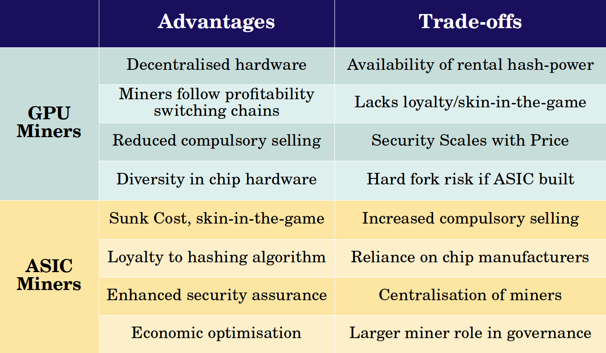
>Comparison between the advantages and trade-offs between GPU and ASIC dominated mining markets

The primary difference in security assurance  between GPU and ASIC dominated hardware, comes down to the alignment of incentives.

**GPU Miners** have minimal skin in the game as they can re-purpose mining rigs to other algorithms to follow profitability. If Decred became the dominant GPU mined chain, it might lead to reduced sell pressure (less locked in CAPEX). However this comes at the expense of overall attack resistance and security assurance (rental hash-power is cheap and larger pool of chains competing for miners). Should Decred remain a minority GPU chain, it would ultimately lead to increased 'dumping' pressure of DCR and significantly reduced security assurances.

**ASIC Miners** sink significant CAPEX into single purpose hardware, creating an unforgeable barrier for entry. This enhances and stabilises security assurances. The trade-off is greater physical miner centralisation and an increase in compulsory selling pressure until miners have recuperated CAPEX expenses.

    Ultimately, bringing ASICs online creates skin in the game and aligns miner incentives with the success of the Decred chain.

The transition from GPU to ASIC miners was an important phase of Decred history. Public interviews with teams from DCRASIC and Obelisk were hosted on Decred Assembly in late 2017 (here and here). The first signs of ASICs coming to market actually appeared in January 2018 when hash-rate began to accelerate, however it really took of from April 2018 onward.

Numerous ASIC chip manufacturers have since released hardware, with a summary of specifications presented in the table below. Where possible, hardware prices are reflective of sale prices at the time of launch, or is a best estimate using prices available at the time of writing.

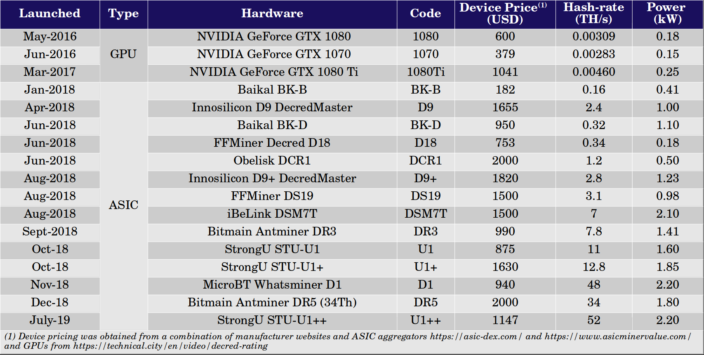

>Summary of Decred mining hardware specifications and assumed unit prices.

Through 2018-19, hash-rate expanded by three orders of magnitude, from 0.50PH/s to a peak of 550PH/s whilst at the same time, DCR prices fluctuated wildly. In 2018, DCR price peaked at $120 in January, fell to $36 in March, rallied alongside hash-rate expansion to a second $120 top in June before commencing the slow, painful decline into the 2019–20 bear market.

The chart below presents the Decred hash-rate (pink), showing the clear ASIC expansion from April 2018, alongside USD denominated miner income (black). The December 2018 capitulation event took DCR prices down to $15 after which it ultimately traded sideways through 2019 and 2020. Miner income however continued to fall as the declining block reward reduces by ~0.99% every 21.33 days. 

Since the December 2018 capitulation event, aggregate daily miner income has declined 33% from ~$55,000 to $37,000 in August 2020, despite coin price trading around $15 on both occasions. PoW issuance of DCR has reduced from 3,350 DCR/day, to 2,520 DCR/day over the same period.

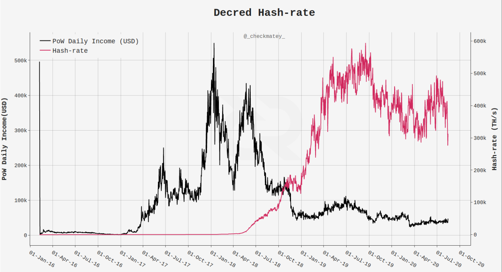
>Decred hash-rate (pink, LHS) and aggregate daily miner income denominated in USD (black, LHS) and DCR (blue, RHS)

ASIC miners invested in chip development and hardware during the first half of 2018, right as the bull market peaked. Miners turned on their machines for three to six volatile months (Q1 to Q2 2018), before the rug was pulled from under them by a savage two year bear. This income squeeze was further compounded by the continual reduction in DCR issuance.

The following sections will look at how these two phases of Decred mining history (GPU and ASIC phases) played out in the DCR distribution cycle and are printed within on-chain metrics.

# Part 3: Miner Supply Distribution Analysis

Blockchain analytics undertaken by Dave Collins [(2017)](https://medium.com/r/?url=https%3A%2F%2Fyoutu.be%2F7K2sDhyjQys%3Ft%3D1675) suggested that Ethereum miners who [dual mined](https://medium.com/r/?url=https%3A%2F%2Fforum.decred.org%2Fthreads%2Fclaymores-dual-ethereum-decred-siacoin-lbry-pascal-blake2s-keccak-amd-nvidia-gpu-miner-11-6.5957%2F) Decred almost immediately distributed DCR to exchanges for sale. This view was further supported by the work of Richard Red who [tracked PoW mined coins for five hops](https://medium.com/r/?url=https%3A%2F%2Fblog.decred.org%2F2020%2F06%2F08%2FDecred-blockchain-analysis-Part-1%2F) to identify the volume reaching known exchange addresses.

Further analysis, shows a well defined change in miner distribution behaviour between GPU and ASIC phases. The charts below consider the following:

- PoW mined coins are tracked for five hops or until they reach a destination such as a known exchange address or a PoS ticket.
The cumulative volume sent to exchanges (solid lines) is normalised by the rolling cumulative sum of DCR minted via PoW issuance (I.e. proportion of global DCR mined sent to exchange).

- The cumulative volume ending up in a DCR ticket, or remaining unspent is combined and considered 'held' or hodled DCR (dashed lines, also normalised). This is an imperfect measure of 'held coins' as it does not follow what happens after a ticket votes and also counts coins which may be lost as held.

- The remainder (not shown in the charts) has an 'unknown' destination after five hops. This may include OTC desks, smaller exchanges, peer-to-peer trading, holding within private wallets etc.

- Since volumes are normalised against rolling cumulative PoW issuance, it creates a continuous curve but blends the transition between the two mining mining phases together. Therefore a second set of curves (yellow) are shown from Jan-2018 onward considering - ASIC data only (i.e. ASIC distribution normalised to ASIC mined supply).

- This analysis is indicative as exact volumes are not easily determined. An arbitrary time delay may occur between a miner minting DCR and spending it. A coin minted by a GPU miner in 2017 may not spend until 2020 for example, however this would be counted as an ASIC spend.

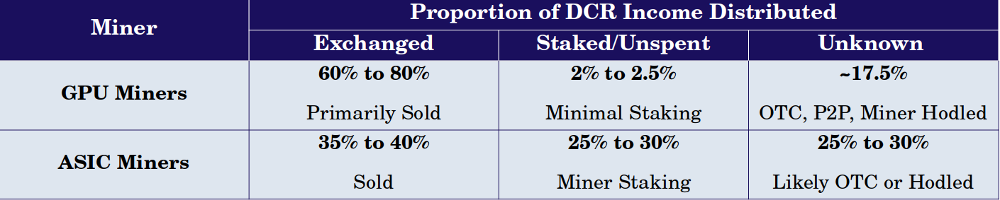
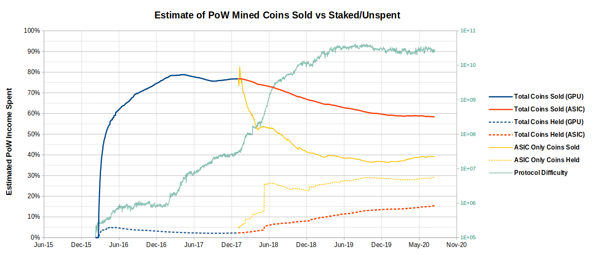
>Decred Miner distribution patterns. Solid lines show proportion of PoW issuance distributed to known exchanges and dashed lines show portion staked/unspent for GPU phase (blue) and ASIC phase (red). Yellow lines show these ratios considering ASIC only data starting in Jan 2018.

GPU Miners can be seen to heavily distribute between 70% to 80% of the coins mined to known exchange addresses. An average of only 2.0% of mined DCR ended up in tickets and 0.5% remains unspent. The remaining ~17.5% has an 'unknown' destination. Some of these 'unknown' coins may have also been sold via OTC or other peer-to-peer exchanges or held privately.

Following the launch of ASICs, there is a notable change in distribution behaviour.

- DCR sold on exchanges by ASIC miners has steadily decreased from 75% of issuance to a current level of around 55% of the total PoW mined coins (solid red). Since 60% of the block reward goes to miners, this means 33% (55% x 60%) of circulating supply has definitely been distributed by miners over the lifetime of the chain.

- Considering ASIC supply only (solid yellow), exchange sales have reached a stable distribution pattern of 35% to 40% of coins mined.

- Unknown destinations now absorb 25% to 30% of mined supply, and given the sophistication and scale of ASIC miner operations, this is most likely to be in large part OTC sales or similar.

- ASIC miners have steadily increased the volume of staking to a similar level of 25% to 30% (aggregate of 15% of total PoW mined coins). This shows continued commitment and additional skin in the game for miners, which suggests miners are taking an active role in network governance. Miner staking also highlights an additional income stream for miners which can supplement returns as well as soften income volatility with low overhead during periods of low hardware profitability.

Overall, ASIC miners appear to be actively participating in staking tickets, at  a steady state of around 30% of mined income. Miners distribute approximately 40% to known exchanges and the remaining 30% is classified as unknown, although is assumed distributed to OTC desks or similar sales.

# Part 4: Performance and Profitability of Decred miners

As described, the Decred mining market is dynamic and complex, being an aggregate of decisions made by miners, chip manufacturers and hobbyists on hardware investment and logistics. Short of making contact with each individual miner, this makes it difficult to ascertain the quantity, performance and types of mining hardware operating on the network.

The single source of truth is [protocol difficulty](https://explorer.dcrdata.org/charts?chart=pow-difficulty&zoom=ikefq8bs-kdxgh6v4&bin=window&axis=time&visibility=true-false) and [block-time](https://explorer.dcrdata.org/charts?chart=duration-btw-blocks&zoom=ikd7pc00-kdutqa6y&bin=false&axis=time&visibility=true-false). With these two metrics however, one can back-calculate an estimated [hash-rate](https://explorer.dcrdata.org/charts?chart=hashrate&zoom=iken56o0-kdutvxkn&bin=false&axis=time&visibility=true-false) and use that as a base-line for comparison to the specifications of mining hardware tabulated above.

The following analysis aims to estimate performance metrics related to the mining market using only hash-rate and hardware specifications as primary inputs. Analysis has been kept as simple as possible by considering a complete fleet of each hardware device (i.e. consider the entire network mined only by DR5 rigs). The author feels this provides sufficient resolution to understand the dynamics of hardware efficiency and network performance. It also provides insight into the profitability of each device.

In the following charts, GPU hardware is shown in dashed lines, ASICs in solid lines and contemporary  state-of-art ASIC devices (D1, DR5 and U1++) are shown in thicker green lines. Each fleet of hardware is assumed to commence operation in full on the first day of the month of release.

**Chart 1 - Device Count:** Number of devices of a single model required to achieve observed hash-rate (actual hash-rate divided by each hardware model's rated hash-power). Perfect device efficiency is assumed and thus this will underestimate equivalent device counts.

The peak hash-rate of 550PH/s would require over 3.8Million GTX 1080 GPUs to achieve and between 16,000 and 12,000 contemporary ASICs.

For comparison, the Bitcoin network, with a hash-rate of 136EH/s, and considering the Bitmain S19 Pro (110TH/s, 3250W), equates to around 1.236 Million S19 ASICs (approximately 77x more ASIC hardware devices than Decred supports at peak hash-rate).

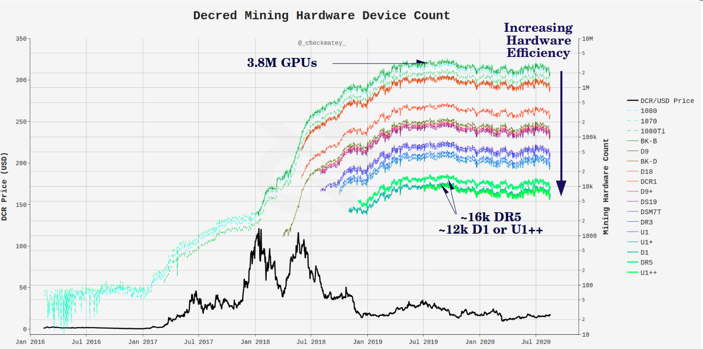
>Chart 1: Estimated quantity of mining hardware devices required to match observed hash-rate. Assumes full fleet of single device type.

**Chart 2 - Device CAPEX:** Total USD investment required to achieve observed hash-rate with a single hardware model (Chart 1 multiplied by device purchase price). Analysis assumes an arbitrary 5% markup on purchase price to account for logistics and facility establishment costs.

At peak-hash-rate (550PH/s), it would require a CAPEX investment of $2B spent on GPUs and $12.5M on contemporary ASICs. For the present hash-rate of 386PH/s, this represents $1.8B in GPU and $8.8M in ASIC hardware.

Taking a ratio of CAPEX to hash-rate for contemporary ASICs, this represents a security assurance of $22.73 in CAPEX investment securing every Terra-hash ($12.5M/550,000TH/s = $22.73/TH/s).

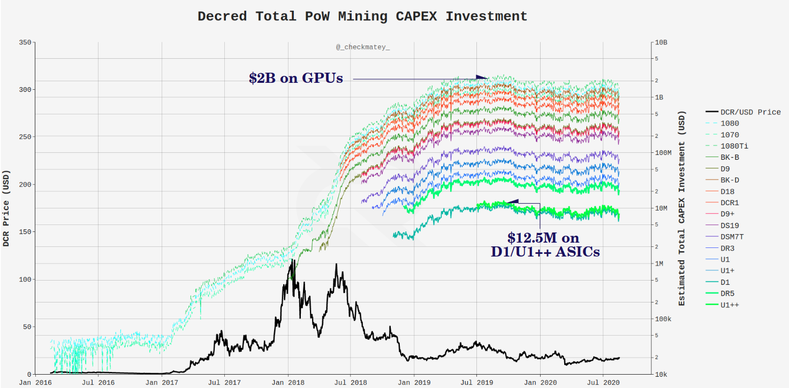
>Chart 2: Estimated CAPEX investment into Decred mining hardware. Assumes full fleet of single device type with 5% markup for logistics/establishment costs.

**Chart 3 -Daily  Power Consumption:** Total power draw in kWh required to maintain observed hash-rate with a single hardware model (Chart 1 multiplied by device daily power consumption).

The quantity of contemporary ASICs calculated in Chart 1 are estimated to consume between 300 and 720MWh per day. For comparison, the Bitcoin network, considering the same S19 Pro ASIC, would consume 96,436MWh per day, approximately 134x more than the Decred network.

>Chart 3: Estimated daily power consumption of the Decred mining network for each fleet of devices. Analysis does not include any adjustments for efficiency loses.

Chart 4 - Daily OPEX Costs: Total USD costs to operate the mining hardware count (from chart 1) considering an 'all-in cost per kWh' OPEX model.

Hash-rate peaked in October 2019 indicating reduced profitability and declined until the recent lows set in March 2020. In May 2020, hash-rate started recovering, suggesting increased profitability for some portion of the mining network. These observations are used to calibrate reasonable all-in cost per kWh rates constituting a 'strong miner' and a 'weak miner'.

It is assumed that both operate contemporary ASICs (D1, DR5 or U1++) and started switching back on dormant rigs from May. Strong miners may have turned a small profit. Weak miners are assumed to be at OPEX break-even (as they would switch off hardware otherwise). Since hash-rate is the reference input, this analysis will account for rigs coming on and off-line.

- **Case 1)** Strong Miner $0.075/kWh all-in sustaining cost.

- **Case 2)** Weak Miner $0.125/kWh all-in sustaining cost.

It must be noted that all-in costs of $0.075/kWh are exceptionally lean and would require extreme efficiency of capital and power to attain (let alone maintain). Similarly, all-in costs of $0.125 are still considered lean, many weak miners have likely operated at higher all-in costs. The following analysis demonstrates just how cut-throat and narrow DCR mining margins have been.

Estimated OPEX costs for Strong miners demonstrates that fleets of DR5 and U1++ ASIC rigs are approximately in line with daily aggregate miner income at an all-in cost of $0.075/kWh. Strong miners are only recently approaching daily break-even to profitability levels (device curve below PoW income curve).

Weak miners, with all in costs of $0.125/kWh, remain non-competitive, with a full fleet costing an equivalent to the available block-reward income on the best days(device curve above PoW income curve).

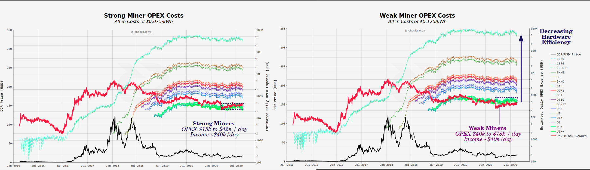
>Chart 5 - Fleet Profitability: Each fleet of mining hardware is assessed for profitability, calculated as aggregate income minus OPEX costs, normalised by CAPEX (i.e. expressed as a proportion of capital recovered each day). A profitability level of 0.01 means the miner has made a profit equivalent to 1% of the total CAPEX invested that day. Negative profitability, as expected, means a loss was made that day.

GPU miners enjoyed profitability throughout during the 'Great Inflation' until ASICs launched in mid 2018. This is ironic considering the majority of mined DCR was distributed immediately, considered a bonus 'tip' to Ethereum miners.
After ASICs launched, profitability rapidly collapsed, as hash-rate competition increased and DCR price entered a bear market. As a result, the majority of mining models are not believed to have ever reached break even.

**Chart 5 - Fleet Profitability:** Each fleet of mining hardware is assessed for profitability, calculated as aggregate income minus OPEX costs, normalised by CAPEX (i.e. expressed as a proportion of capital recovered each day). A profitability level of 0.01 means the miner has made a profit equivalent to 1% of the total CAPEX invested that day. Negative profitability, as expected, means a loss was made that day.

GPU miners enjoyed profitability throughout during the 'Great Inflation' until ASICs launched in mid 2018. This is ironic considering the majority of mined DCR was distributed immediately, considered a bonus 'tip' to Ethereum miners.

After ASICs launched, profitability rapidly collapsed, as hash-rate competition increased and DCR price entered a bear market. As a result, the majority of mining models are not believed to have ever reached break even.

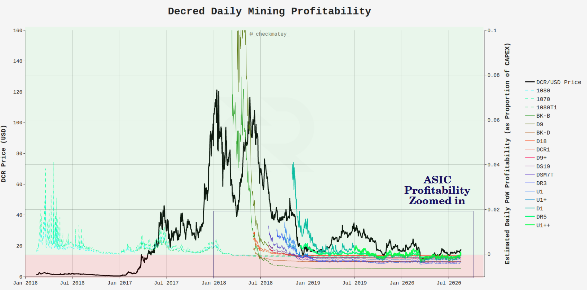
>Chart 5a: Global profitability for all mining hardware expressed as a ratio of CAPEX invested (i.e. proportion of CAPEX recovered/lost each day)

**Strong miners** have barely maintained profitability at around 0.1% to 0.4% of CAPEX per day (meaning it would take ~1000 days to break-even on their investment). Considering miners operate on a marginal profit basis, this provides reasonable confidence that miners with all-in costs of around $0.075 to $0.100/kWh are active on the Decred network. This may also be a result of miners who entered early, achieved some profitability and therefore have a lower overall cost basis today.

**Weak miners** on the other hand, have operated at a consistent loss of around 0.1% of CAPEX per day since mid 2019 (this includes those with outdated rigs). This is coincident with the peak network hash-rate set in October 2019 and and again provides confidence that the assumed all-in costs are appropriate boundaries for miners who are 'in or out of the money'. Any miner operating rigs other D1, DR5 and U1++ are unlikely to have recovered the CAPEX invested.

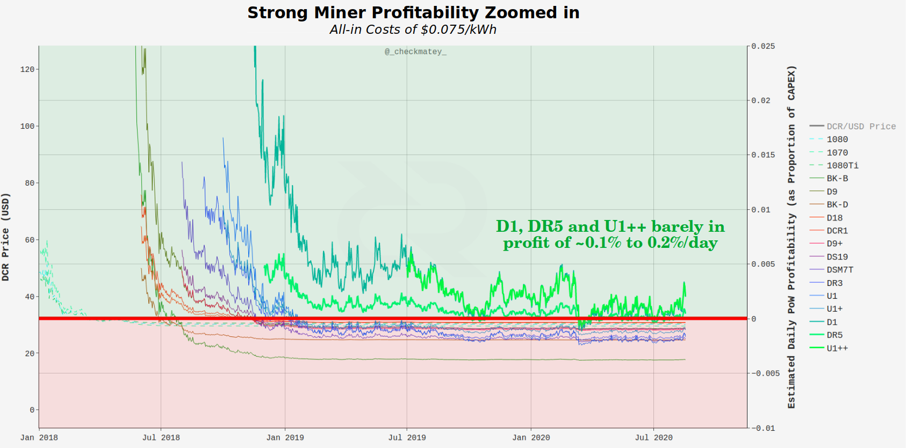
>Chart 5b: Zoom in of ASIC profitability from Jan 2018 onward for Strong miners.

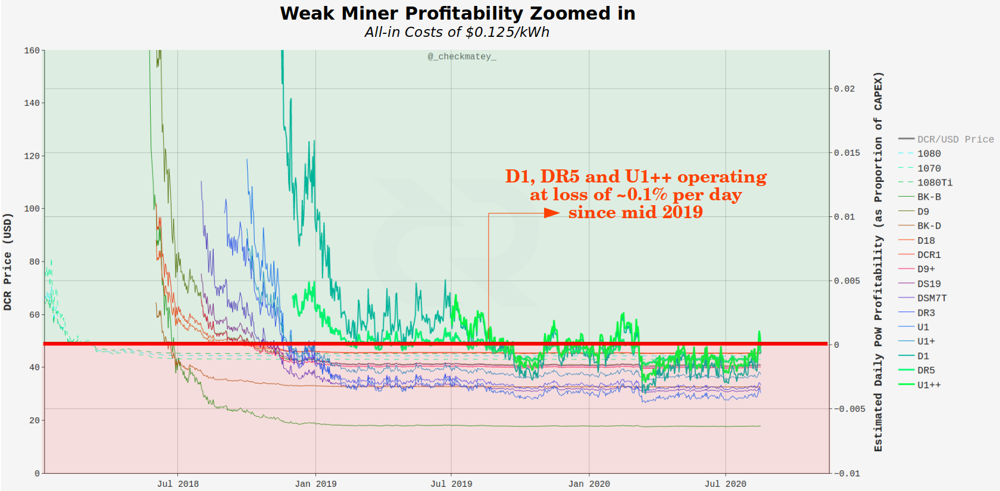
>Chart 5c: Zoom in of ASIC profitability from Jan 2018 onward for Weak miners.

**Chart 6 - CAPEX Recovery and Capitulation:** This analysis assumes miners are rational profit motivated actors who seek to recover their CAPEX investment. By calculating the cumulative profitability for mining hardware (running sum of chart 5 above) provides a gauge on whether the  hardware has paid itself off. For example, if the device achieves three days of +0.1% profitability, in theory, it has recovered 0.3% of the original invested CAPEX.

Where negative profitability is encountered, it will erase previous gains in the cumulative sum. Since the device count is updated each day to match actual hash-rate, this method will capture devices being switched on-off and thus can identify device capitulation in the market cycle.

Of course, this calculation is an indirect and imperfect measure. Miners only sell a portion of their income and coins are not spendable on the date and price of minting. Miners also have unique financing and energy arrangements as well as various strategies to balance profitable/unprofitable days. Therefore, this metric should be considered as indicative of overall device performance relative to its peers.

**GPU miners** likely achieved almost immediate recovery of hardware CAPEX from mining Decred alone, let alone dual mining with Ethereum.

**ASIC miners** who entered the market very early in 2018 (BK-B and D9 rigs) likely broke even thanks to the second major rally from March to June 2018 as well as the first mover advantage of being first ASICs live on the network during the 'Great Inflation' at $120/DCR.

**Strong Miners** operating D1 rigs are likely profitable being the first launched contemporary rig. Those operating DR5 or U1++ rigs likely have sufficient profitability to continue operations. This also correlates with the increase in hash-rate since May 2020. Outdated ASIC hardware has likely retired, especially following the March 2020 sell-off.

**Weak Miners** are unlikely to have broken even irrespective of rig under operation as all are estimated to be extremely unprofitable.

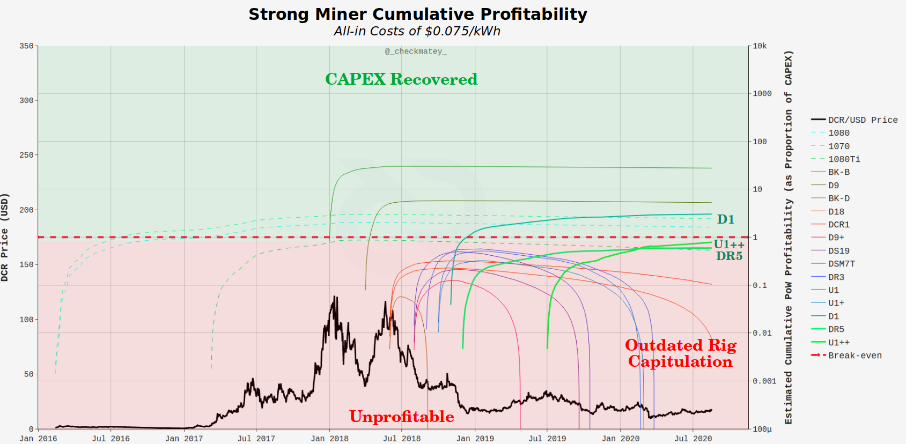
>Cumulative profitability of Decred mining hardware under strong miner assumptions of $0.075/kWh.

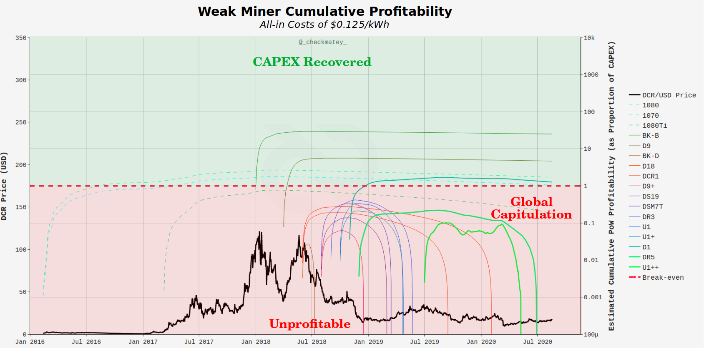
>Cumulative profitability of Decred mining hardware under weak miner assumptions of $0.125/kWh.

## Summary of Decred miner Performance
So far, we have established a number of key observations and time-frames throughout Decred mining history.

- 2016 to 17 - GPUs dual mining Decred with Ethereum dominate the hash-rate and immediately sell up to 80% of coins. 

- January to June 2018 - ASICs launch into volatile pricing at the top of the bull market. Early ASIC models had a short window of opportunity to break even.

- December 2018 - First major capitulation across the cryptocurrency market takes Decred down to ~$15 where it trades sideways (on average) through to Q3 2020. Aggregate Miner income continues to bleed out by 33% due to the reducing block-reward issuance.

- October 2019 - Hashrate peaks at 550PH/s as inefficient and outdated ASIC rigs begin to capitulate and weak miner OPEX costs force more rigs offline. Hash-rate falls to a low of 254PH/s in April 2020.

- March 2020 - Second market wide capitulation due to the COVID-19 pandemic drives DCR prices as low as $7 and likely causes capitulation of many remaining weak miners.

# Part 5: On-chain Miner Metrics

This final section will present a number of on-chain metrics developed specifically for Decred, or originally designed for Bitcoin but remaining relevant across Proof-of-Work networks.

For reference, following behaviours are broadly applicable to Proof-of-Work miners, especially those with skin-in-the game using ASIC hardware, and even more so where miners are also staking DCR tickets.

- **ASIC Miners** are serious Bulls - Miners have committed significant financial investment and operating costs into ASIC hardware and facilities. They are both the largest compulsory  sellers, and the networks biggest bulls, having made an unforgeable bet on the future success of the Decred chain.

- **Miner Feast** - many ASIC miners have treasuries of the mined coin which they seek to expand whenever profitability allows. As prices rise, miners begin to HODL more and this constrains supply further as fewer coin sales are needed to recover costs. A network of profitable miners is generally a net positive for price action until new competition fills the gap by expanding hash-rate.

- **Miner Famine** - poor miner profitability has the opposite effect, as the fixed USD denominated costs for power, facilities and debt repayments persist, whilst block reward income value is diminished. As a result, miners must sell more coins to cover the same fixed costs, further depressing coin price.

- **Miner Capitulation** - extended periods of miner stress ultimately lead to capitulation of the weakest operations. After turning off as many machines as possible to stay afloat, some ultimately fold. This leads to a final liquidation of treasuries, heavy sell pressure and notable reduction in network hash-rate.

- **Miner Expansion** - Following capitulation, as the difficulty adjusts downwards, it makes room for strong (or new) miners to expand and become profitable, gaining a larger share of the hash-power. The strong miners now have more income, similar fixed costs and eventually, the cycle begins to repeat as they grow their treasuries, constrain supply and often initiate the next bull market.

---

    > As the ancient cypherpunk Proverb goes:

    > Miners put the bottom in.
---

## Block Subsidy Models

The [Block Subsidy models](https://medium.com/@permabullnino/decred-on-chain-a-look-at-block-subsidies-6f5180932c9b) were developed by Permabull Nino, and calculate the cumulative sum of USD denominated block rewards paid to miners, stakers, the Decred Treasury, and to the network on aggregate. This model represents the aggregate cost of production (the thermo-cap) and can be considered the income cost basis for each supply side. Where market valuation is higher than the block subsidy models, the network is profitable on aggregate.

Conversely, when market valuation trades below the aggregate network income line (orange), it signals that the Decred supply side as a whole is likely under income stress. Where valuation falls below the PoW subsidy line (thermo-cap), it signals that miners in particular are under financial stress.

There have been two such instances where Decred network valuation has fallen below the thermo-cap, both followed by a quick correction to the upside.

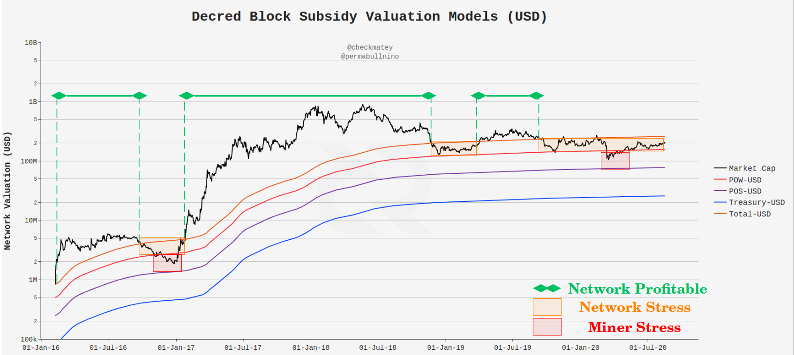
>Decred block subsidy models showing zones where miners were profitable (green) and where they were under income stress (orange) and extreme stress (red).

## Difficulty Ribbon

The [Difficulty Ribbon](https://woobull.com/introducing-the-difficulty-ribbon-the-best-times-to-buy-bitcoin/) was developed by Willy Woo as a ribbon of moving averages for  protocol mining difficulty. Where miners are expanding their operations, difficulty increases and the ribbon will expand as the short period averages track difficulty closely whilst long period averages lag behind. The chart below shows confluence between overall network profitability (market cap > total block reward) and periods of difficulty ribbon expansion (green).

Conversely, miner stress is signified by compression and squeezing of the difficulty ribbon, as short period averages fall and long period averages catch up.

Periods where network valuation was below the aggregate block subsidy line correlate with significant difficulty squeezes. Where valuation falls below the miner thermo-cap, the difficulty ribbon has historically bottomed and then begins to begins to re-expand. This suggests miner capitulation has occurred and strong miners have gained share of hash-power, finding improved profitability - putting the bottom in.

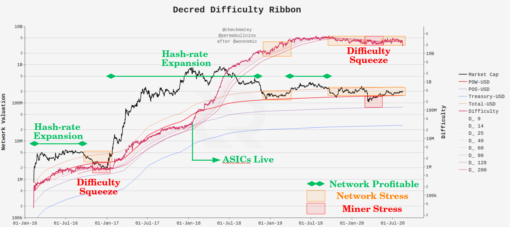
>Decred Difficulty ribbon (after Willy Woo) overlaid on the block subsidy models showing periods of miner stress (orange, red, ribbon squeeze) and profitability (green, ribbon expansion)

## Puell Multiple

The [Puell Multiple](https://medium.com/unconfiscatable/the-puell-multiple-bed755cfe358) was developed by David Puell and cryptopoiesis. This metric takes the ratio of daily USD income for miners to the 365-day moving average of that income. Since ASIC miners are long term investors and planners, comparing today's income to their yearly average provides indications of extreme profitability (high ratio) or income stress (low ratio).

Similar to the block subsidy model and difficulty ribbon metrics, the Puell Multiple identifies both peak miner profitability (Q2 and Q4 2017) and extreme miner stress (Q1 2017, Q1 2019 and Q2 2020).

The red and green oscillator bands are selected based on the historical frequency of occurrence for Puell Multiple values with 10% to 20% chance of occurrence, being points of increased probability for mean reversion.

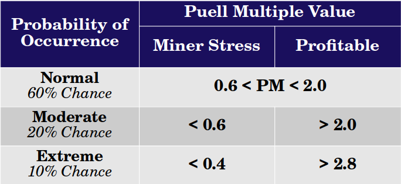
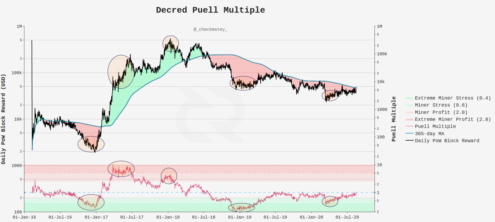
>The Decred Puell Multiple (method after David Puell and cryptopoiesis), showing daily USD block reward and its 365-day moving average (LHS), and the Puell Multiple oscillator and associated probability bands (RHS)

## Miner Pulse

The Miner Pulse was developed by Permabull Nino which constructs an oscillator (measured in seconds) of the aggregate deviation of block-time from the protocol target of 300 seconds. As more hash-power comes online, blocks will temporarily speed up and be shorter than the target until protocol difficulty adjusts upwards (and vice-versa). Since Decred difficulty adjusts every 12hrs, sustained periods of fast or slow block-times indicate market wide profitability or stress, respectively.

During the GPU Phase, it can be seen that block-times generally oscillated with the trend of price as miners follow profit potential. The 2018 ASIC expansion becomes evident after January 2018 with block-times consistently -2s faster than the protocol target until the metric peaked around -5.2s in July 2018.

Miner stress commenced after the December 2018 market wide sell-off as block-times slowed down by +1.0s to +1.2s until Q1 2020. The miner capitulation actually peaked in February 2020, before the March 2020 sell-off due to COVID-19. This result is coincident with the modelling in Part 4 which identified Q1 2020 as the time where outdated rigs and weak miners were likely to begin capitulating. 

The appearance of more fast blocks in late Q2 2020 aligns with the unfurling of the difficulty ribbon, increasing hash-rate, and valuation bounce back above the thermo-cap. 

This confluence of indicators suggests that the worst of the mining capitulation storm is probably over, and perhaps greener shoots are starting to grow on the other side.

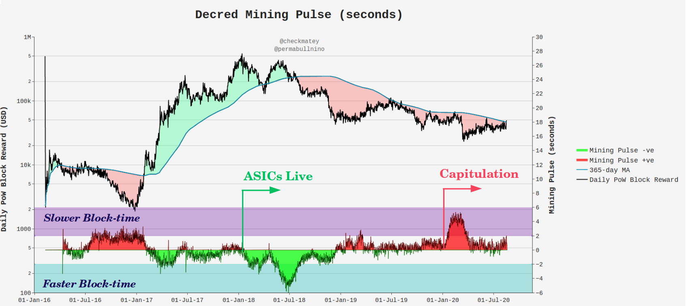
>Decred Mining Pulse oscillator by Permabull Nino, showing daily USD block reward and its 365-day moving average (LHS) and the Mining Pulse oscillator (RHS)

# Concluding Remarks

Proof-of-Work mining is a seriously difficult business. Not only is it dynamic and in constant evolution, but the global free market for power and finance make it ruthlessly competitive. The Decred protocol has an in-built deleveraging mechanism in the Difficulty Adjustment which acts to squeeze profitability down to the finest of margins.

This paper explored the history of Decred mining to date, ranging from early dual ETH-DCR GPU miners, right through to the challenging market conditions for almost all ASIC miners. It showed two very different appreciations for DCR's value proposition, with GPU miners selling en mass and ASIC miners continuing to put skin-in-the-game via staking tickets.

One thing is very clear, ASIC miners have had a really hard go. After investing and launching hardware at the peak of the 2018 bull market, the rug was pulled out from under them for two long bearish years that followed. This has modt certsinly weighed on the DCR price. That said, there are numerous signals that the worst of the storm is over with most outdated mining rigs and low efficiency miners likely flushed out in Q1 2020.

Of interest is the remarkably small power and hardware footprint required by Decred in comparison to Bitcoin, despite boasting [security assurances](https://explorer.dcrdata.org/attack-cost) which fight in the [same heavyweight ring](https://medium.com/@_Checkmatey_/decred-hypersecure-unforgeably-scarce-e076b91a2be). This is an area that warrants further study.

Finally, the suite of four PoW specific on-chain metrics available for Decred illustrate the peaks, troughs and everything in between. They have shown confluence and reliably track the heartbeat of the Decred mining network. As such, they make excellent resources for miners, investors or research analysts seeking to better understand and follow the dynamics of DCR mining.

    Overall, the widest possible distribution of DCR coins is essential for decentralising governance rights. 
    
    Whilst heavy distribution has no doubt weighed on DCR price performance, this has built a foundation for maximum distribution, resilience, security and longevity.

    In this light, Proof-of-Work has worked exceptionally well for Decred.

## Special Thanks

Special thanks to notsofast for letting me pick his brains and resources with respect to the early days of Decred GPU mining. Thanks to Richard Red and Permabull Nino for their review and comments.

Big shout out and thanks to @OfficialCryptos on twitter for the cover artwork. If you would like to support this artist, DCR tips are appreciated: DsTp1vjpaPniJVTJxdhH2h7x7JtMC6sCyih

## Disclosure

This paper was written and researched as part of the author's [research proposal](https://proposals.decred.org/proposals/a677e23) accepted by the Decred DAO. Thus, the writer was paid in DCR for their billed time undertaking the research. Nevertheless, the study aims to be objective and mathematically rigorous based on publicly available market and blockchain data. All calculations and charts are produced via the authors [publicly available codebase](https://github.com/checkmatey/checkonchain).

# References

[1] - ASIC Device Data - https://asic-dex.com/

[2] - ASIC Miner Data, https://www.asicminervalue.com/

[3] - Decred GPU Mining, https://technical.city/en/video/decred-rating

[4] - Claymore Dual Miner Github Repo, https://github.com/Claymore-Dual/Claymore-Dual-Miner

[5] - Claymore Bitcointalk release post, 2016, https://bitcointalk.org/index.php?topic=1433925.0

[6] - Decred blockchain analysis Part 1 (+ data), Richard Red, 2020, https://blog.decred.org/2020/06/08/Decred-blockchain-analysis-Part-1/

[7] - Decred Explorer and dcrdata, https://explorer.dcrdata.org/charts?chart=hashrate&zoom=iken56o0-kduxo0hx&bin=false&axis=time&visibility=true-false

[8] - Introducing the Difficulty Ribbon, signaling the best times to buy Bitcoin, Willy Woo, https://woobull.com/introducing-the-difficulty-ribbon-the-best-times-to-buy-bitcoin/

[9] - The Puell Multiple, cryptopoiesis, 2019, https://medium.com/unconfiscatable/the-puell-multiple-bed755cfe358

[10] - Decred On-chain: A look at block subsidies, Permabull Nino, 2019, https://medium.com/@permabullnino/decred-on-chain-a-look-at-block-subsidies-6f5180932c9b

[11] - Decred On-chain: Mining Pulse, Permabull Nino, 2020, https://medium.com/@permabullnino/decred-on-chain-mining-pulse-3b28d5155a04

[12] - Decred Assembly ep15, Decred and ASICs, 2017, https://www.youtube.com/watch?v=8TPFIVYy_i4&list=PLaMrpvQ0yJ_z8ZtvgBqinmL74_0W7prv2&index=13

[13] - Decred Assembly ep16, ASICs Part II, 2017, https://www.youtube.com/watch?v=8TPFIVYy_i4&list=PLaMrpvQ0yJ_z8ZtvgBqinmL74_0W7prv2&index=13
