# Decred Realised Value and the MVRV Ratio

## Realised Cap Primer

The Realised Cap is a metric originally developed for Bitcoin by the [coinmetrics team](https://coinmetrics.io/realized-capitalization/) in response to perceived shortcomings in the traditional Market Cap for valuing the network. The Market Cap, being the total coin supply multipled by current spot price, has a tendency to over-estimate the liquid network value as it assigns equal economic weight to all UTXOs.

In reality, UTXOs have a different relative activity within a crypto-asset network. Long dormant coins, such as those in deep cold storage, or with the private keys lost, should have their economic value reasonably discounted. Old UTXOs, especially those older than six months are statistically less probable to be spent and re-enter circulation than those the more recently active counterparts.

The chart below illustrates this point, presenting the full historical transactions count (by year) bundled by age range at the time the UTXO was spent, along with the implied probability. UTXOs younger than 24hrs represent over 60% of all spends, and those older than 6months account for less than 10% (data Source: Glassnode).

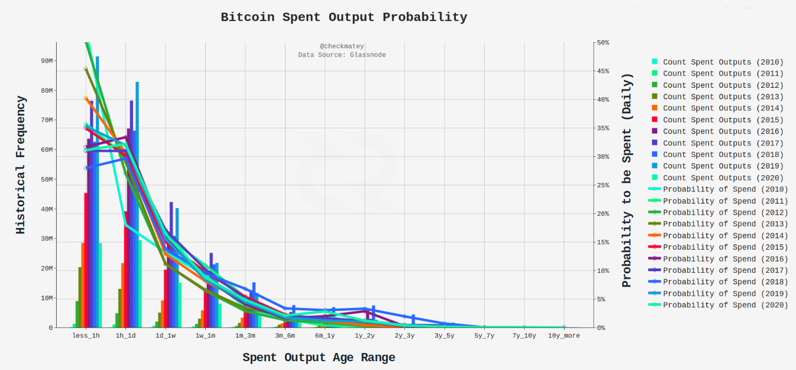

The Realised Cap was designed to account for this phenomena by valuing each UTXO at the price when is was last spent. For Bitcoin, this method can be considered analogous to the fiat denominated value 'saved' in BTC. Historically this has resulted in a 'stair stepping' fractal though market cycles with the key market dynamics driving this behaviour summarised in the following graphic.

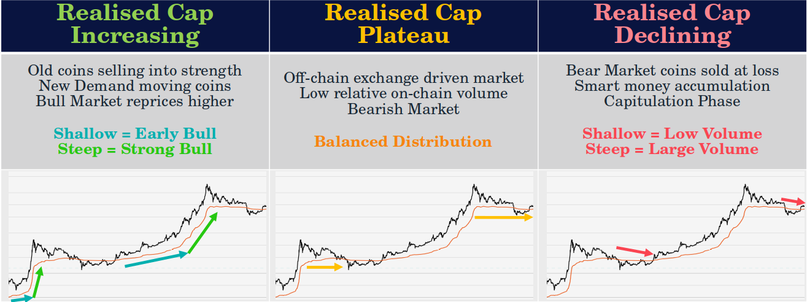

By dividing the realised cap by circulating BTC supply, we can also determine a market **Realised Price**. Given the realised cap is a form of aggregate 'stored value' for the Bitcoin market, the realised price is essentially the aggregate cost basis price level and thus represents a key psychological trading level where the bulk of unspent UTXOs are either in profit, or underwater.

Through past market cycles the realised cap tends to act as a strong psychological support level level during bear markets and, periods where the market cap falls below the realised cap have signalled strong accumulation opportunities (MVRV Ratio < 1.0). Conversely, where market cap far exceeds the realised cap, it signals a potential blow-off top with a majority of UTXOs in significant profit and thus becomes an opportune time to realised profits.

[The MVRV ratio](https://medium.com/@kenoshaking/bitcoin-market-value-to-realized-value-mvrv-ratio-3ebc914dbaee) was first presented by David Puell as a tool to identify such market extremes by showing the relative distance between the market and realised capitalisations as an oscillator.

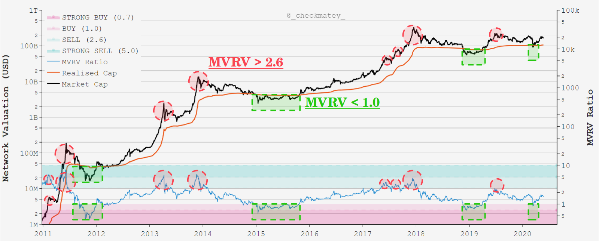

# The Decred Realised Cap

UTXOs held by strong-hand Bitcoiners can often be characterised by long periods of dormancy, usually with few intermediate transactions between the original acquisition withdrawal, and the eventual spending/sale transaction. The realised value of these UTXOs are not re-priced often, making the movement of old coins acquired at much cheaper prices noticeable, primarily manifesting as a steepening of the realised cap gradient.

For Decred, this is not the case, as many high conviction DCR holders are active participants in the Proof-of-Stake ticket and governance system. A significant volume of DCR coins are therefore in consistent circulation through the chain. This means that the Bitcoin heuristics and realised cap interpretation detailed above, cannot be accurately applied to Decred.

Instead of forming plateaus and undergoing discrete, steep 're-pricing' fractals described above, the Decred realised cap tends to follow the market cap much more closely. As DCR UTXOs are re-priced on a more frequent basis, periods of high transaction demand will 'snap' the realised cap towards the market cap, and conversely, the two will separate during periods of low transaction demand.

The Decred realised cap captures an important psychological level in that it represents the aggregate price where the market last interacted with their coins, capturing a sort of 'recency bias'. People who regularly interact with their DCR holdings via tickets, CoinShuffle++ mixes or governance votes are likely to have heightened awareness of coin price. Therefore, the opportunity cost of realising profits or losses on their DCR is baked into each transaction. The explicit decision to buy a ticket over sending coins to an exchange for sale is a reflection of meaningfully bullish sentiment for each individual, and vice-versa.

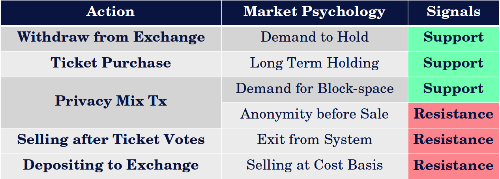

With this framework in mind, the realised cap represents a key psychological support level during bull markets and resistance during bear markets, a phenomena that shows up in historical price action. The Decred realised cap may be considered the long term psychological mean, the price at which each holder last interacted with their holdings and can be all shades of bullish and bearish.

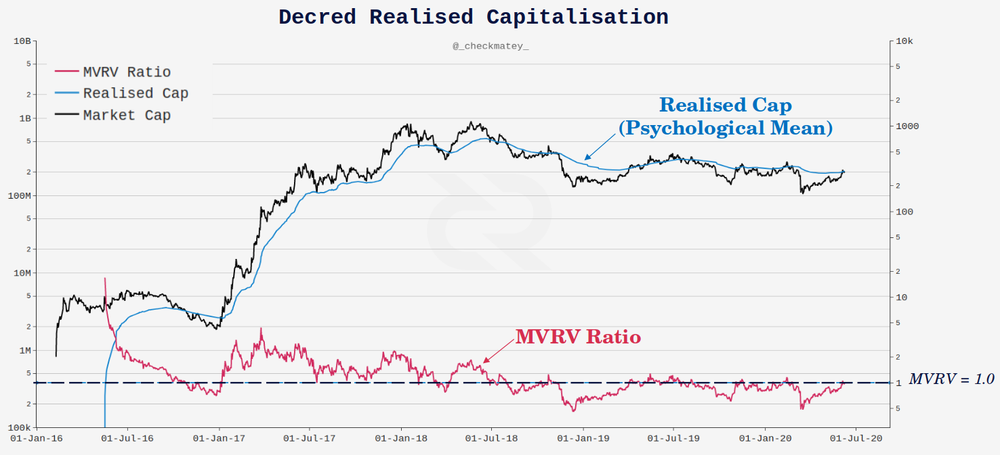

# Decred Realised Cap and MVRV Fractals

## **Bull Market Fractals**

In periods of bullish market sentiment, a number of example market behaviours are expected:

- New DCR holders will withdraw coins to private key custody and initiate transactions;

- Marginal buyers and sellers increase trading deposits/withdrawals;
    
- Demand for Decred tickets and governance participation increases;

- Miners liquidate treasury holdings into market strength;

- Long term holders and contractors HODL but also deposit coins to exchanges to realise profits.

As a result, the realised cap calculation will re-price an increasing volume of DCR causing the realised cap metric to snap towards the market cap. Given appreciating price plays an important role in market sentiment, this generally manifests as a steepening positive gradient and higher price levels for the realised cap. A similar mechanism is observed for Bitcoin during late stage bull markets.

During the 2017-18 bull market, the realised cap acted as a strong buy support level in six significant instances, singalled by an MVRV ratio equal to or below 1.0. The market cap spent the majority of the time trading above the realised cap as reflected in the MVRV trading above unity.

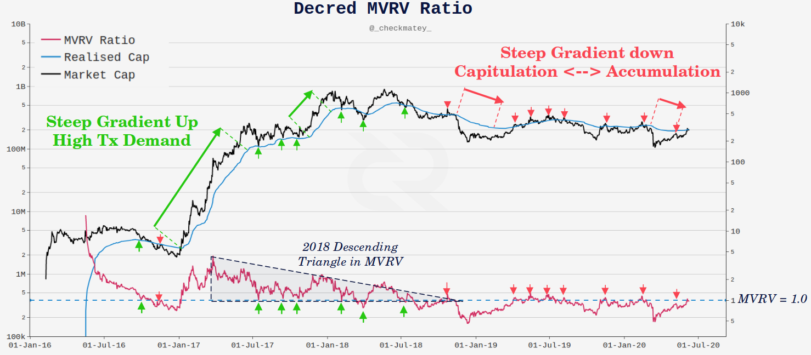

## **Bear Market Fractals**

In periods of bearish market sentiment, a number of example market behaviours are expected:

- Fewer new participants enter the market and thus deposits and withdrawals slow down;

- Marginal buyers and sellers dominate price action with greater trading volume occurring off-chain;
    
- Demand for Decred tickets and governance participation decreases;

- Miners liquidate larger flows of income and treasury to cover fixed costs;

- Long term holders and contractors bunker down holdings for the winter.

Through 2018 (early bear), the MVRV ratio formed a descending triangle with base at an MVRV equal to 1.0. The market cap finally broke below realised cap support in July, retested it from below in October and eventually capitulated alongside the broader cryptocurrency market in December 2018.

During the 2019-20 bear market, the market cap retested the realised cap (MVRV = 1.0 from below) on at least eight significant occasions with each one hitting sufficient resistance to push prices down further. Two notable market capitulation/accumulation phases occurred, the first from Dec 2018 to Apr 2019 and again in Mar-Apr 2020. Both were periods where USD denominated prices of DCR plummeted over ~50% and on-chain volumes spiked to relatively high levels, leading to a rapid re-pricing of DCR UTXOs to lower levels and a steep decline in the realised cap.

This particular fractal, of declining realised cap, is more pronounced for Decred than for its Bitcoin counterpart. Historically, the Bitcoin realised cap rarely has a steep negative gradient as market interest at the end of bear markets has often waned, and the dominant source of volume is attributed to traders and off-chain exchanges. For Decred, the consistent flow of DCR in tickets results in the realised cap following spot pricing to a greater extent in both directions.

It is important to remember, that someone is on both sides of every trade, and one person's capitulation is another's accumulation. Large volume signals that there is disagreement over the current market price. For Decred in particular, interpretation of realised cap and MVRV signals is enhanced when there is significant on-chain (and off-chain) volume supporting a change in momentum. The chart below shows zones where notable peaks in on-chain transaction volume have accompanied notable breaches or decoupling of the market and realised caps such as capitulation/accumulation events.

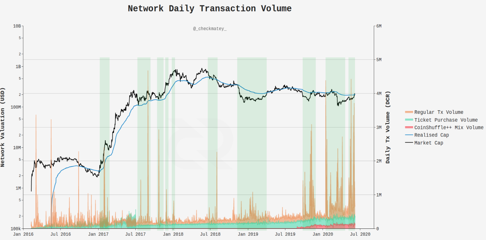

## Extreme Values and Reversals

The basis of the realised cap as psychological mean is further reinforced by the Decred protocols design as a self-equalising system. Both the Proof-of-Work difficulty and Proof-of-Stake ticket price seek equilibrium of hash-power and DCR bound in tickets to regulate coin issuance to the target block-time. Where demand for tickets falls, the ticket price also falls to incentivise additional ticket purchases until an equiliberium of inflow is reached to refill the ticket pool. Conversely, rising ticket demand will increase the ticket price, stemming the flow of DCR on-chain via this mechanism.

By developing a frequency histogram and cumulative distribution curve for the daily close of the MVRV Ratio, we can apply a probability framework to what is considered an 'extreme value' and points of likely mean reversion. It can be seen in the plot below that the MVRV ratio approximates a log-normal distribution centred around a value of 0.9 to 1.0, reinforcing the realised cap as a protocol valuation mean.

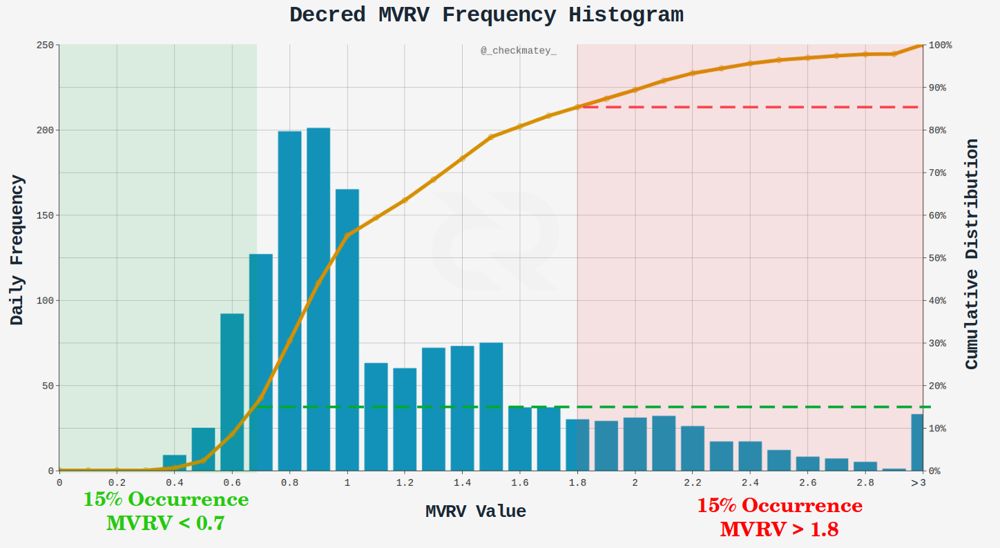

Taking an arbitrary reference probability of 15% chance of occurrence as our definition of 'extreme value', we can establish MVRV values where there is an 85% chance of mean reversion based on historical performance. The chart below presents these MVRV oscillator boundaries on the buy side (MVRV < 0.7) and sell side (MVRV > 1.8). Charting alongside historical price action suggests this system has reasonable accuracy.

It is also evident that Decred carries a greater number of 'signals' than Bitcoin, both for points of mean reversion (extreme MVRV values) and for support/resistance (MVRV = 1.0), where Bitcoin tends to signal fewer generational cycle bottoms and tops only.

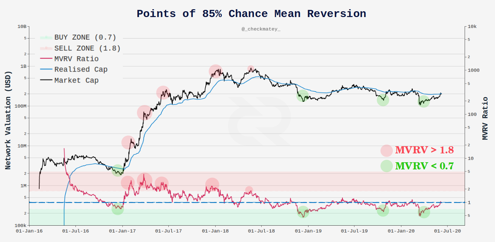

## Market-Realised Gradient

The market cap is influenced directly by spot pricing, trading algorithms and derivatives, in near-real time. Thus, it tends to be a noisy metric with many false signals. The whole school of technical analysis and charting is aimed at applying a probability framework to price action fractals in a bid to determine likely trend direction across various time-frames.

The realised cap on the other hand is a smoother, slower metric which filters out the off-chain exchange volume and narrows down on the meaningful economic activity occurring on the ledger. Realised value is slower to respond as DCR bound in tickets need to vote and unlock, holders need to sign and initiate transactions and exchange withdrawals and deposits take time to process.

Given the market and realised cap represent fast/noisy and slow/convincing signals respectively, we can compare the trend orientation and gradient for each metric. This provides insight into changes in momentum for market pricing and DCR holder sentiment.

For example:

- If the market cap transitions to a strong downtrend (negative gradient) whilst the realised cap remains in an uptrend (positive gradient), it may be a leading indicator of a macro price and sentiment trend reversal to the downside, that is yet to show up on-chain. A flat to negative trending realised cap would confirm this reversal.

- A flattening out of the realised cap gradient after a prolonged downtrend signifies that a large volume of DCR has been acquired at cheaper local bottoms and is now circulating, likely in PoS tickets. It may also indicate reduced miner or marginal seller activity on-chain, suggesting momentum and sentiment may be shifting back to the upside.

Since the market cap (and hence gradient of it) moves much faster than the realised cap, it will reverse trend first. By taking the difference between the market gradient and the realised gradient (termed the **Delta Gradient**), we can observe a leading indicator of these market shifts when the Delta Gradient crosses zero from above (bearish reversal) or below (bullish reversal).

Gradients for both metrics can be positive (uptrend) or negative (downtrend) and over time the rate of change of the gradient provides insight into price and sentiment momentum. Where a gradient gets steeper over time (higher oscillator peaks), it means a continuation or acceleration of the trend is likely. Conversely, a flattening trend (lower oscillator peaks) may indicate weakness in the current trend and increased likelihood of macro trend reversal.

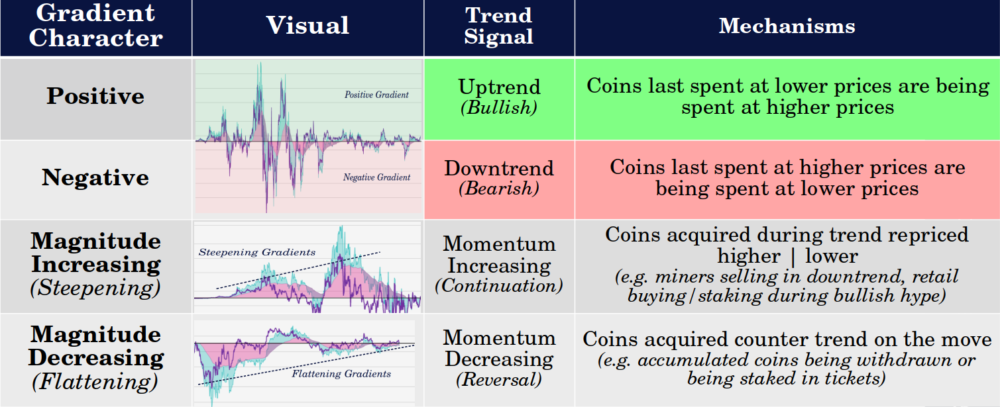

With this in mind, we can calculate the 28-day and 142-day gradient of both the market and realised caps. These periods are selected due to the alignment with the average and maximum time for tickets within the pool to vote and thus provide fast/noisy (28-day) and slow/high conviction (142-day) signals.

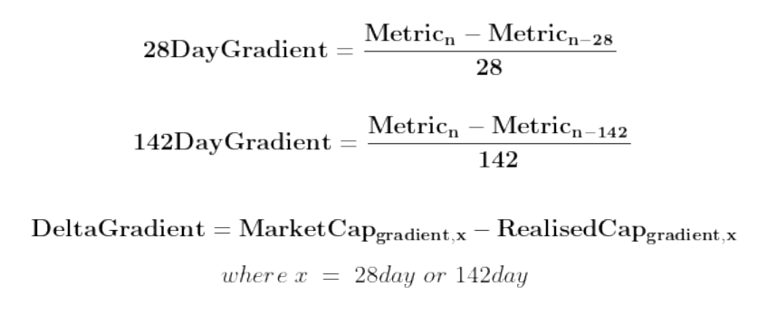

**28-day gradient**

The 28-day gradient is a faster, more responsive, but noisy metric and is best suited as a shorter term trading signal. The chart below shows inflection points where the 28-day **Delta Gradient** (purple line) crosses zero from above (bearish) or below (bullish) signalling short term shifts in price and sentiment momentum.

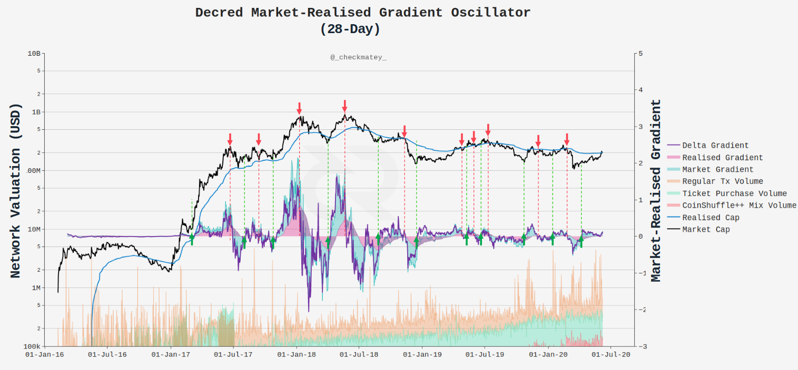

**142-day gradient**

The 142-day gradient is a slower, less responsive but higher conviction macro trend indicator, providing greater insight into long term market momentum. Of particular interest for this indicator are changes in magnitude of the gradient over time, otherwise known as divergences in traditional technical analysis.

A steepening of gradients (increasing oscillator peaks) over time suggests continuation and acceleration of the prevailing trend. Conversely, a flattening of the trend gradient (decreasing oscillator peaks) suggests a weakening of the prevailing trend and signals a possible trend reversal.

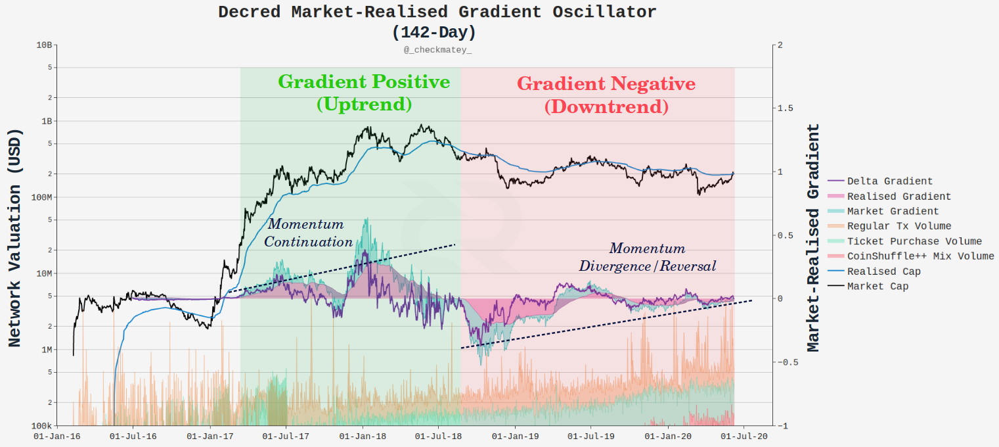

On the basis of these indicators and metrics at the time of writing, the following signals are described as an example:

- The market price ($17.56) is hovering slightly below the realised price ($17.73) after a small two week rally, corresponding to an MVRV ratio of 0.99. This is the eighth attempt price has made at breaking above an MVRV of 1.0 since the capitulation event in Dec 2018.

- Significant and sustained volume can be observed on-chain since around Sept 2019, higher than that occurring in 2016-17. Transaction flows can be attributed to both regular, ticket purchase and CoinShuffle++ transaction types.

- 28-day Gradients and Delta Gradient are both positive and appear to be marginally increasing. The 28-day delta gradient has not broken below zero and thus remains a hold signal.

- 142-day Gradients and Delta Gradient have established three progressively lowering peaks since Aug 2018, forming a noteworthy bullish divergence and indicating a potential weakening of the prevailing downtrend.

## Summary and Conclusions

The realised cap is a useful metric for valuing crypto-asset networks as it focuses in on the active supply that is economically meaningful at any time. Whilst the formulation is borrowed from Bitcoin, direct application of the same heuristics to the Decred network is misleading due to fundamental differences in on-chain transaction behaviour.

This paper described the mechanics which influence the price and trend of the realised cap and the MVRV ratio. The MVRV was detailed within a historical probability framework to establish a set of 'extreme values' of over/under valuation. The Decred MVRV ratio provides a wider variety and greater frequency of signals than its Bitcoin counterpart due to the intrinsic tie to DCR holder psychology and 'recency bias'. It provides insight into key levels representing bullish support, bearish resistance and extreme value on either side.

Finally, the comparative evolution of Decred market momentum can be distilled into short-term (28-day period) and long-term (142-day period) oscillators derived from the market cap and realised cap gradients. These metrics work particularly well for Decred in response to the consistent base-load of Proof-of-Stake tickets that ensures a large volume of DCR is consistently re-priced, giving the realised cap a unique interpretation for a unique blockchain.