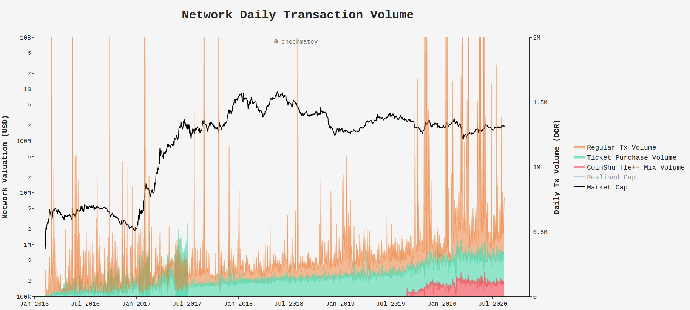
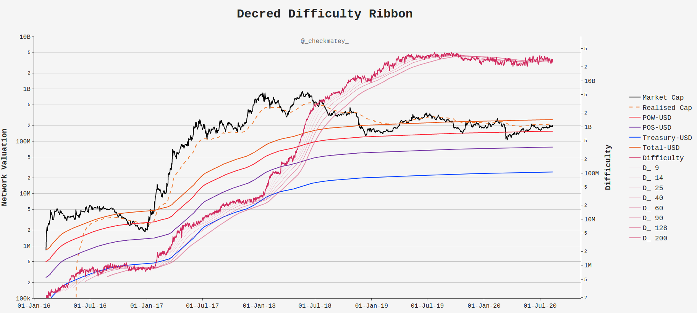
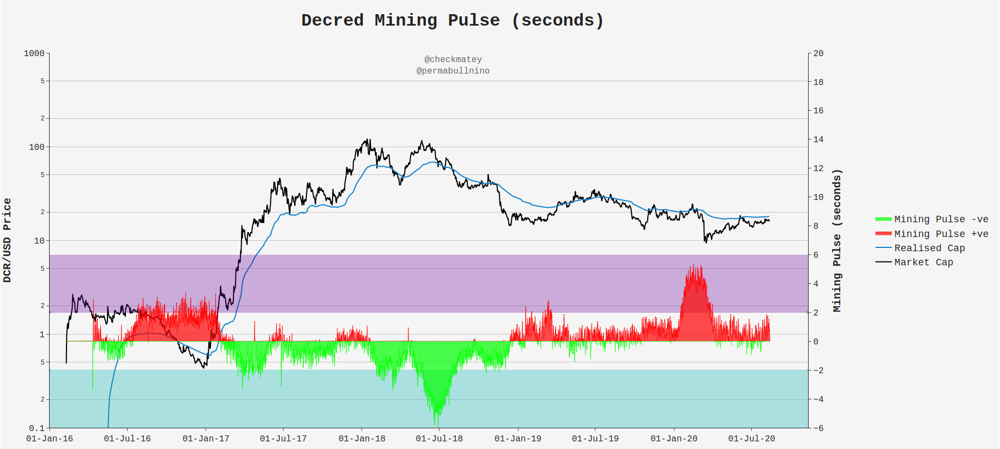
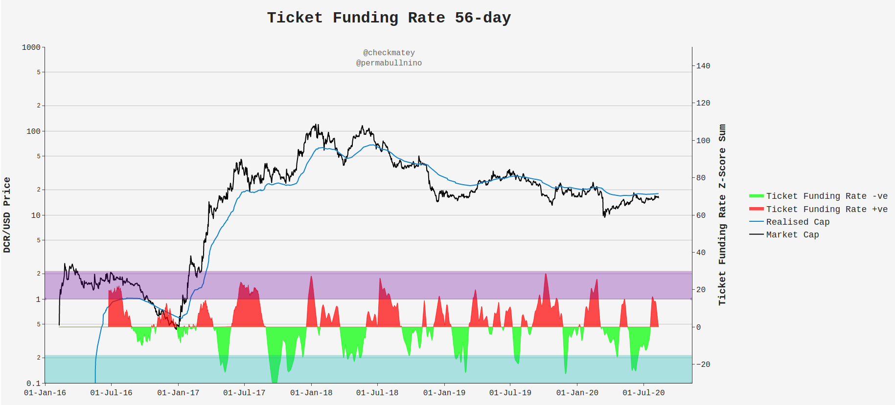
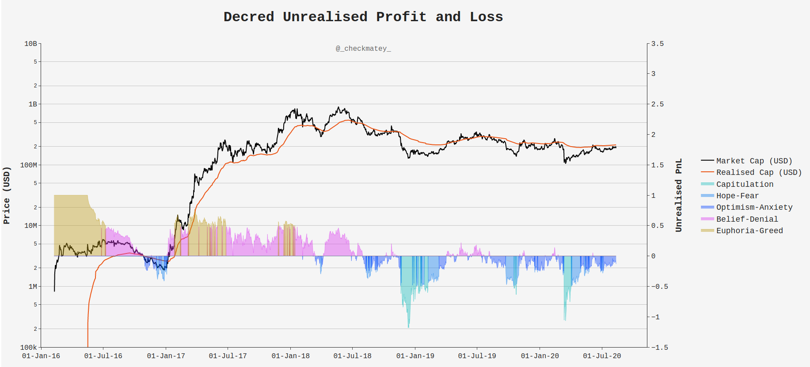

# Our Network - Week 6

## Insight 1 - Daily Transaction Volumes

In August 2019, Decred released a privacy CoinJoin implementation using the CoinShuffle++ protocol which integrated mixing with its Proof-of-Stake ticket system. Users may opt to mix their funds prior to purchasing a ticket, or just participate in the mix taking advantage of consistent liquidity.

After 1 year of operation, the CoinShuffle++ mixer anonymises an average of 100k DCR per day (red). Compared to the 200k DCR on average spent purchasing tickets (green), this represents a significant relative volume onchain. The mixer is currently accessed via command line only at this stage with the GUI set for released in the main Decrediton wallet in Q3 which is expected to further increase mix liquidity and volume.

## Insight 2 - Miner Performance

Decred miners have experience extremely challenging financial conditions with ASIC hardware launching at the peak of the 2018 bull run. Difficuly increased by three orders of magnitude at the same time as price fell an order of magnitude, from $120 to $15.

The market value of DCR has finally broken above (and retested) the cumulative PoW-USD block reward curve (also known as the thermo-cap, or cumulative cost of production). This observation was supported by a 31% boost in network hashrate from lows of 320PH/s to around 420PH/s today, as well as an unfurling of the difficulty ribbon to the upside.

## Insight 3 - Miner Pulse

Decred difficulty adjusts every 12hrs making it extremely reflexive to changes in hashpower coming on and off the network. A powerful metric developed by @permabullnino to monitor the response of miners to dynamic conditions is the Miner Pulse.

This metric constructs an oscillator (in seconds) by measuring the delta between actual block-time, and the target block-time of 300 seconds. Where miners are coming online, hash increases, blocktime speeds up and the Miner Pulse goes green (and vice-versa). After a long and challenging bear, the first sign of green shoots are starting to show up, supporting the increased hashrate, valuation break above the thermocap and the unfurling of the difficulty ribbon. Using this combination of metrics, one can start building a thesis of miner profitability and likely break even prices.

## Insight 4 - Ticket Funding Rate

Another metric developed by @permabullnino is the Ticket Funding Rate. Decred PoS rewards decrease over time as the protocol issuance approaches the 21M cap. Simultaneously, the price of tickets has increased as more coins enter circulation. This creates a dynamic supply and demand market for tickets as stakeholders gauge the risk-reward of sacrificing coin liquidity in exchange for the PoS reward and voting rights.

The ticket funding rate attempts to measure this change in sentiment. In particular, the 56-day period (2x the average vote time of 28-days) measures stakeholder willingness to re-bind 'just voted' coins for a second ticket. A strong willingness shows up as low oscillator values (green) and vice-versa (red).

## Insight 5 - Treasury Vote Power

Finally, the Decred market cap is once again attacking the underside of the realised cap. Historically, the realised cap is the strongest of support in bullishg conditions and stroing resistance in a bear market. Given the importance of on-chain transactions for stakeholder voting rights, the realised cap is the purest form of stakeholder recency bias and sentiment printed on-chain.

The Unrealised Profit and Loss metric captures the aggregate mood by taking the normalised difference between market and realised valuation. Since the March lows, Decred holders have progressed into a preiod of Anxiety as the realised cap is challenged from the underside for the ninth significant test of the bear. 

