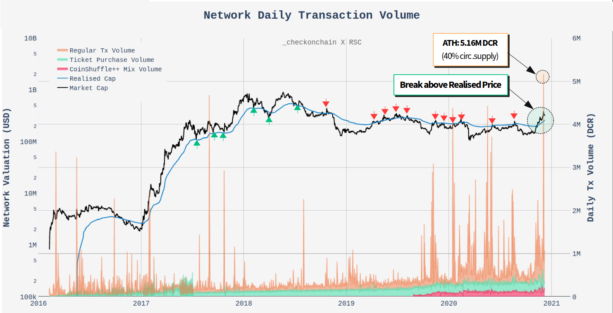
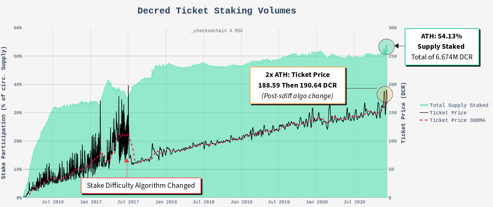
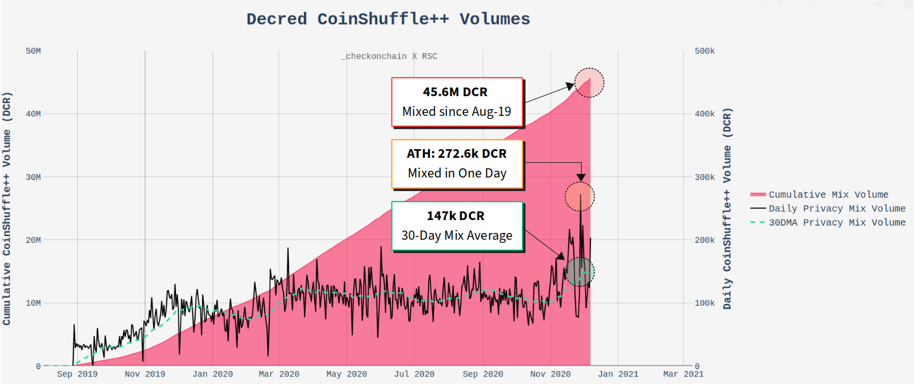
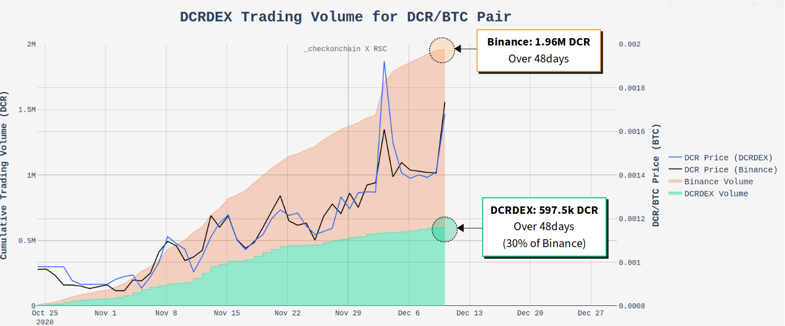
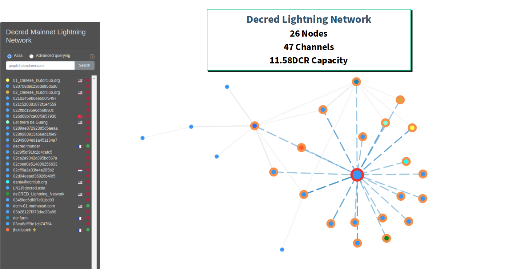

# Our Network - Week 7

## Insight 1 - Daily Transaction Volume ATH

The Decred network has experienced a non-trivial increase in network activity and transaction volumes during Q4-2020, with a number of on-chain metrics hitting all time highs.

In mid November, Decred price finally overcame a key psychological resistance level in the Realised Price. Supporting this break, on-chain transaction volume increased to a average of over 1.0M DCR moving on-chain daily. This activity is leading the Realised Price to trend strongly higher and on the 3-Dec, a new all-time-high of 5.16M DCR was settled on-chain (~40% of circulating supply!).

## Insight 2 - Supply Staked in Tickets ATH

Decred has a major consensus change vote upcoming which, if approved on-chain, will hand over all Treasury spend transactions from a multi-sig, to a formal DCR stakeholder vote. This protocol upgrade has been under development for a number of years and is a greatly anticipated a transition to full stack DAO.

In the lead up to this consensus vote, the total supply of DCR staked in tickets has reached a new All Time High of 54.13%, equivalent to 6.674M DCR. The Ticket Price also hit two consecutive ATHs first at 188.59 and then at 190.64 DCR 11 days later (ATH considered after the stake-diff algo change).

## Insight 3 - CoinShuffle++ Volume ATH

Decred is in the process of releasing a significant wallet GUI upgrade which supports the CoinShuffle++ Privacy mixing implementation. Over the past month, wallet release clients have been tested by the community with a corresponding boost to the daily volume flowing through the CoinShuffle++ mixer.

On 28 November, daily mixed volume reached a new ATH of 272.6k DCR, at the time equivalent to $5.94M in value. The 30-day average daily mix volume has increased 50% from the long term average of ~100k to over 150k DCR per day. Since August 2019, a total volume of 45.6M DCR has been anonymised (over 3.7x circulating supply!).

## Insight 4 - DCRDEX Atomic Swaps

Decred recently released the MVP implementation of DCRDEX, a decentralised exchange that utilises atomic swap technology. A DCRDEX server may be hosted by any entity, each with full and permissionless autonomy over which market pairs they list.

The DCRDEX server that is hosted by the Decred project has been publicly live with a DCR/BTC pair for 48-days. To date, a total of 597.5k DCR has been traded, representing 30% of the equivalent volume on Binance. Price on the DEX has also maintained close parity with that trading on centralised exchanges.

## Insight 5 - Decred Lightning Network

Finally, Decred's implementation of the Lightning Network is now live and operational on Mainnet. The GUI is built into release client wallets and is in the early stages of live experimentation by the community.

In the first month, the Decred Lightning Network has established 26 Nodes, 47 Channels and supports a total capacity of 11.58DCR. Early days but certainly an exciting step towards seeing the Lightning Network growing on Decred.

