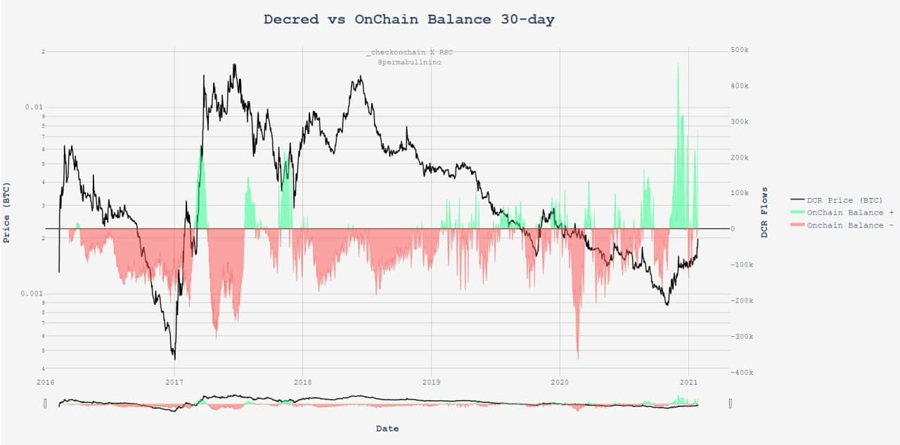
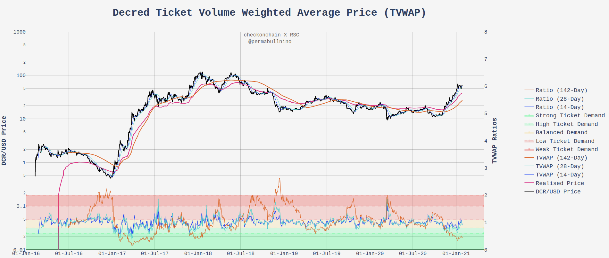
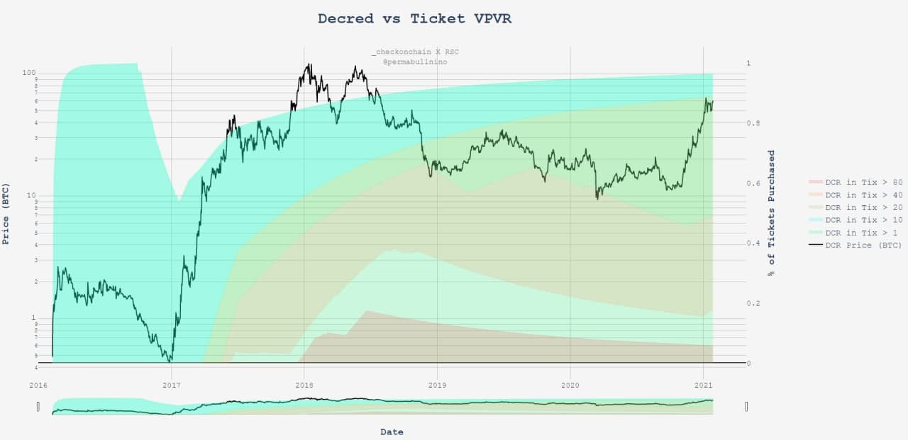
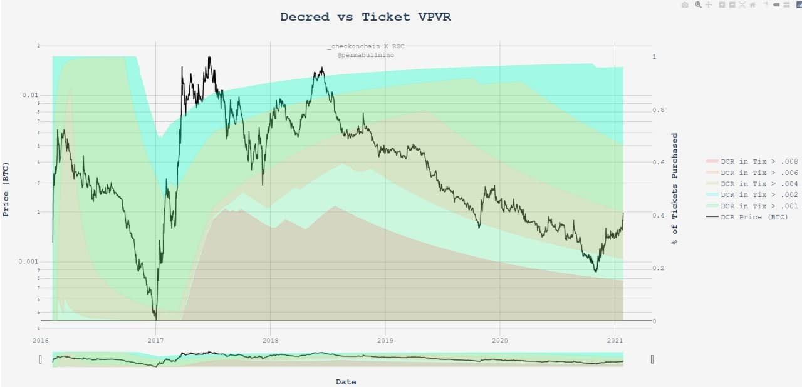

# Our Network - Decred Week 8

## Insight 1 - Onchain Balance

Decred is a hybrid Proof-of-Work + Proof-of-Stake network, and with this comes fascinating on-chain supply and demand dynamics. The On-Chain Balance is a tool developed to measure the supply issuance (PoW+PoS block rewards) minus staking demand (DCR flows into tickets) over a 30-day period.

In 2017, there were three large positive spikes in Onchain Balance (greater flow into tickets than PoW+PoS issuance), which all supported an appreciation in price. 2020/2021 has seen five such spikes with a net overflow of 460k DCR into tickets. Most recently, Onchain balance has seen the largest ever relative inflow to tickets supporting a doubling in DCR/BTC price.

## Insight 2 - Ticket Volume Weighted Price

Similar to on-chain balance, we can track the volume weighted average purchase price of Decred tickets over a period of time. During bullish markets, where demand for tickets is strong, these moving averages will 'keep pace' with price as larger volumes of DCR are pushed into staking.

This manifests as values of TVWAP ratio close to 1.0 which generally support bullish sentiment. The 14-day and 28-day TVWAPs are following price extremely closely whilst the 142-day TVWAP is reversing from the lowest value (most bullish) since June 2017. This indicates a strong increase in recent demand for staking DCR, turning around the slower long period TVWAP Ratio.

## Insight 3 - Stakeholder Breakeven Rates

Staking within the Decred ecosystem is a pseuo-random timelock of value representing “skin in the game”. Stakers relinquish coin liquidity to secure the network and voting rights in return for a share of the block reward.

The charts below track the USD & BTC prices where DCR have been staked over the network’s lifetime. By analysing this data, we can track potential profit, loss, and breakeven levels for Decred’s biggest bulls.

USD chart takeaway:
-  Only 17% of DCR ever staked has occurred above $40, signaling DCR stakers are currently in reasonable profit on a USD basis.

BTC chart takeaway:
-  Staker breakeven level is around ~.004 DCR/BTC. Above this level approximately 60% of stakers will be in profit on a BTC basis.

